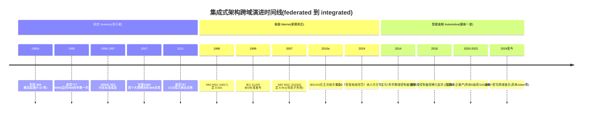
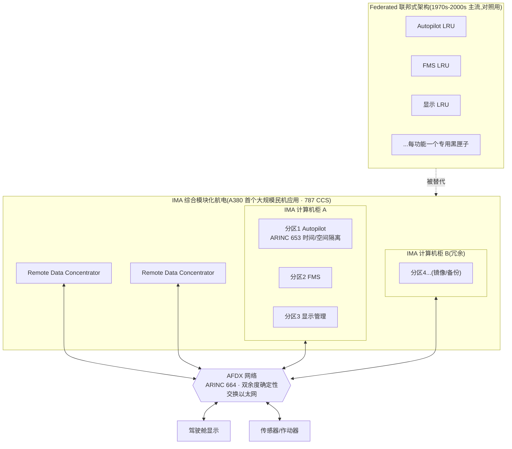
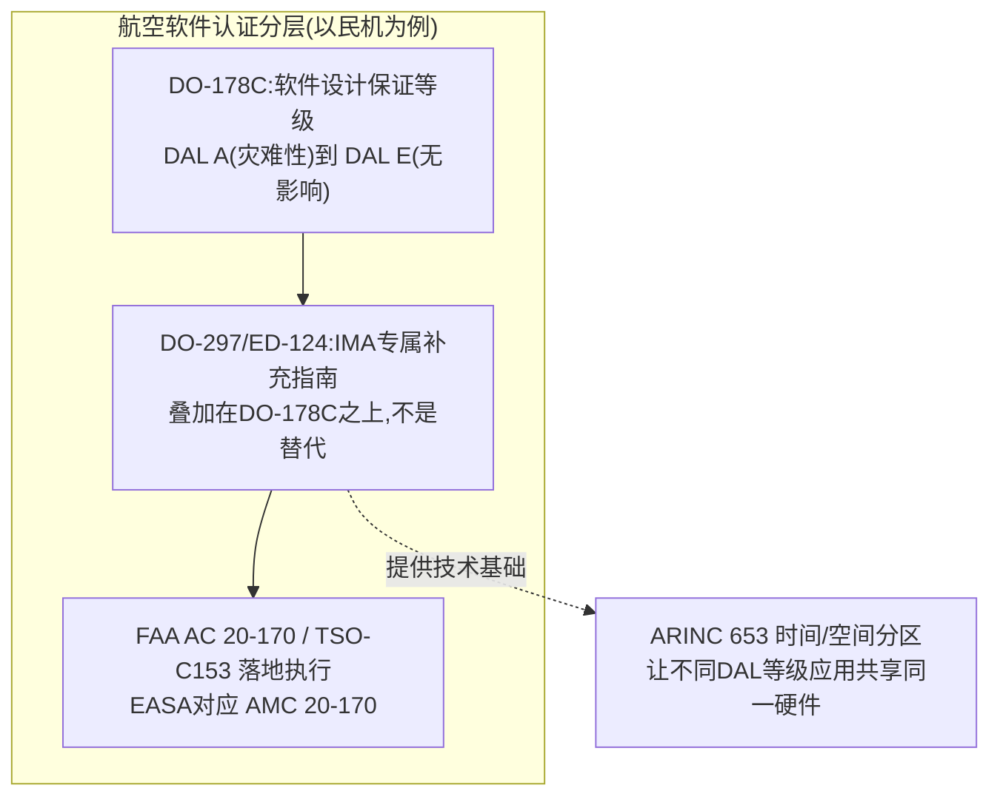
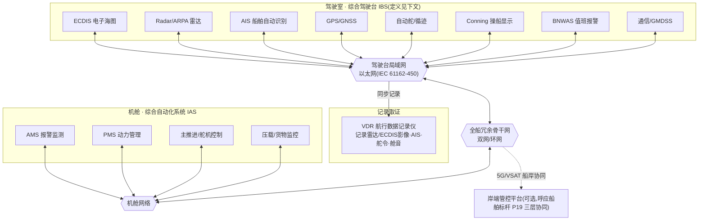
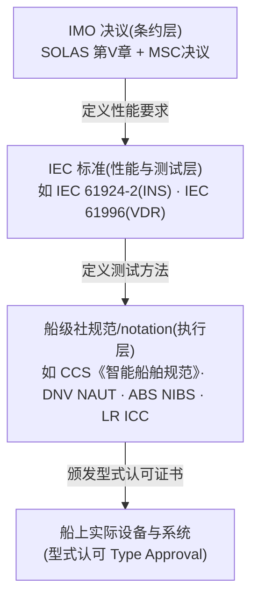
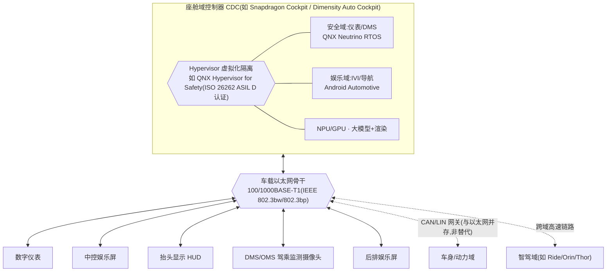
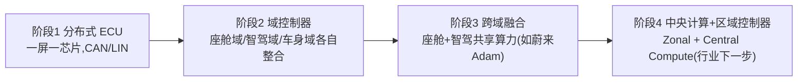

# 标杆案例 ④·详解版 · 集成系统架构团队学习手册(图文全本)

> **这是什么**:`集成系统架构-跨域知识卡片.md` 的**详解版/教学版**——两者关系就像太空舱标杆的「原文要点」和「逐段批注」:知识卡片是**方案写作时的速查卡**,这份手册是**新人/团队上手前的学习材料**,图更多、案例讲得更透、专门加了一章"规避低级错误"。
> **面向谁**:第一次接触"综合驾驶台""域控制器""航电"这些词的团队成员;要在客户面前讲这套架构、又怕被问倒的同事。
> **怎么用**:建议按顺序通读一遍(一到两小时);之后当**词典 + 错题本**查——遇到不确定的术语翻第八章,写方案前过一遍第七章自检清单。
> **和知识卡片的分工**:知识卡片负责"方案里怎么用"(招 7 执行层面);这份手册负责"为什么是这样、别踩什么坑"(理解与自检层面)。两份都更新时互相校对,不重复的内容尽量各写各的,重叠处以知识卡片为准(它是对外使用的版本)。

---

## 一、为什么团队要懂这个

方案里最容易露怯的地方,不是"我们能力强不强",而是**架构图那一页被技术评委多问两句就穿帮**。常见穿帮方式:
- 把厂商名字、标准编号说错(评委里总有懂行的人,一个"NACOS 是劳斯莱斯的"这种错误,足以让全篇的可信度崩掉)。
- 把"某公司的demo"讲成"行业标准做法",被追问"这是谁定的规矩"时答不上来。
- 架构图本身没有主线,被评委一句"这些框图什么关系"问住。

这份材料要解决的不是"多会画图",而是**"讲清楚这套架构为什么可信、可信在哪、别在哪句话上翻车"**。

**再强调一次跨域参照的用法边界**:我们不卖航电,拿航空举例只是因为它是这套模式里验证时间最长、监管最严的行业——**类比,不是抄袭关系,更不是我们也做航电**。这句话在客户面前必须说清楚,否则容易被理解成"我们在蹭概念"。

---

## 二、全局:一张时间线看懂三个行业的节奏

**怎么读这张图**:三条线**不是同一件事的三个阶段**,而是**三个行业各自独立走完的同一种转型**。差距不是巧合——安全监管越严的行业,越早被逼着解决"故障隔离"这个硬骨头(飞机摔不起、船撞不起),所以航空最先蹚出这条路,船舶紧随其后,汽车座舱因为传统上"娱乐屏挂了不死人",反而是最后一个规模化的。这也是为什么跟客户讲的时候,"这条路经过几十年验证"是站得住的,但"三个行业互相抄标准"是站不住的(第五、六章会细讲这个界限)。

---

## 三、航空 · Integrated Modular Avionics 深度解析

### 3.1 从"一堆黑匣子"到"共享计算平台":这条路是怎么走出来的

老式飞机(federated 联邦式架构)的做法很直白:自动驾驶一个盒子(LRU)、飞行管理一个盒子、每块显示屏一个盒子……每个盒子自带处理器、内存、电源,靠专用线缆一对一接到对应传感器/作动器。这样做的好处是**故障隔离靠物理隔离**——一个盒子坏了,物理上不可能连累别的盒子,认证起来简单直接。

坏处也很直白:**盒子数量=重量+接线+成本+备件种类**,一架飞机几十上百个专用盒子,每个都要单独维护、单独备件、单独走认证。飞机越来越"聪明",这条路越来越走不动。

IMA 的思路是反过来:**不再靠"物理上是两个盒子"来保证故障不互相连累,改靠"软件层面划好边界"**——把好几个功能的软件,放到同一套共享计算硬件上跑,但用 **ARINC 653** 这样的分区操作系统标准,给每个软件分区分配**固定的 CPU 时间片 + 独立的内存区**,做到"一个分区崩了,不会拖累其他分区",效果上等价于以前的物理隔离,但省下了盒子、重量、接线。

这条路走了很久才成熟,原因是**认证成本极高**——民航要证明"软件隔离"和"物理隔离"一样可靠,需要一整套新标准(DO-297)、新测试方法,监管机构(FAA/EASA)要认可,这个过程花了十几年。**这正是这套模式最大的说服力来源:不是一拍脑袋的新概念,是拿"人命关天"的行业验证过十几年的路。**

### 3.2 架构详解图

**配套认证分层图**(讲清楚"软件隔离凭什么让监管机构点头"):

**这张图的关键点**:DO-297 不是把 DO-178C 扔掉重来,而是**叠加**——先证明每个软件模块本身符合它该有的 DAL 等级,再额外证明"共享硬件"这件事本身不会互相干扰。这个"叠加不替代"的逻辑,后面讲汽车 ISO 26262 的 freedom from interference 时会用到同一个类比。

### 3.3 典型案例深度解析

**案例1:波音777 AIMS(1995)——"迈向 IMA 的第一步",不是完整 IMA**
AIMS(Airplane Information Management System,霍尼韦尔承制)用两个机柜、每个机柜 8 个可更换模块(4个输入输出模块+4个核心处理模块),通过 ARINC 629 总线连接,确实把好几个功能整合到了共享硬件上。但它用的是总线(ARINC 629),不是后来的交换式以太网(AFDX),分区隔离的成熟度也不到后来的标准。行业文献一般把它定位成"**IMA 的早期一步**",不是"第一个 IMA 系统"——这个区分很重要,后面第 3.5 节会讲为什么。

**案例2:空客A380(2007)——首个大规模民机 IMA 应用**
A380 用 CPIOM(Core Processing Input/Output Modules,由 Thales 和 Diehl 联合开发)作为共享计算模块,通过 AFDX 网络互联,是行业公认的**第一个大规模应用 IMA 的民航客机**。这是可以放心引用的说法。

**案例3:波音787 CCS(2011 投入商业运营)——GE 承制的开放式共同核心**
787 的 Common Core System 由 GE 航电系统承制,运行在兼容 ARINC 653 的 VxWorks 653 操作系统上,把"80 多项功能整合进一套计算机系统",常被形容为比 AIMS 更开放、更彻底的 IMA 实现。2011 年 10 月随全日空投入商业运营(不是 2009 年——这是个常见的错误年份,下面错题本会再提一次)。

### 3.4 知识点速查(航空篇术语表)

| 术语 | 是什么 |
|---|---|
| **LRU** | Line Replaceable Unit,可更换单元——federated 时代"一功能一盒子"的那个盒子 |
| **IMA** | Integrated Modular Avionics,综合模块化航电——共享计算平台的整体思路 |
| **ARINC 653** | 分区操作系统标准,定义 APEX API,提供时间/空间隔离 |
| **APEX** | ARINC 653 里定义的应用程序接口(APplication EXecutive) |
| **AFDX / ARINC 664 Part 7** | 确定性交换以太网,双余度、按 Virtual Link 保证带宽——IMA 的网络骨干 |
| **DAL** | Design Assurance Level,软件设计保证等级,A(灾难性)到 E(无影响) |
| **DO-178C** | 民航软件研发的基础标准,定义 DAL 分级 |
| **DO-297 / ED-124** | IMA 专属的补充认证指南,叠加在 DO-178C 之上 |
| **CPIOM** | 空客 IMA 里的核心处理输入输出模块 |
| **CCS** | 波音787 里的 Common Core System(注意:和"中国船级社 CCS"是完全不同的两个缩写,别在同一份材料里混用不加说明) |

### 3.5 规避的坑(航空篇)

1. **别把 ARINC 661 和 ARINC 653 搞混**:ARINC 661 管的是**驾驶舱显示系统接口**(显示渲染和应用逻辑解耦),和"时间/空间分区"毫无关系,分区的事完全是 ARINC 653 管。这个混淆很容易发生,因为两个编号长得很像。
2. **别说"波音777 就是 IMA 的开创者"**:准确说法是"迈向 IMA 的早期一步",完整意义上的大规模民机 IMA 应用从 A380 算起。
3. **别精确引用 A350 "整合了几个系统"这类具体数字**:这类数字来自厂商宣传材料的二手转述,没有找到能直接核实的一手来源,精确到个位数的对比数字容易被追问出处时露怯。可以说"A350 比 A380 更进一步扩大了 IMA 的整合范围",不要说具体整合了多少个系统。
4. **787 的减重数字别编具体磅数**:公开资料只说"减少数百磅线缆"这类定性说法,没有找到权威的精确数字,别自己编一个听起来更"精确"的数字。
5. **787 投入商业运营是 2011 年,不是 2009 年**:2009 年是较早的一次讨论/目标日期,容易被张冠李戴。

---

## 四、船舶 · Integrated Bridge System + Integrated Automation System 深度解析

### 4.1 从"各管一段"到"综合驾驶台":为什么船东愿意换

老式驾驶室是什么样:雷达一个独立屏、海图桌上摊纸质海图或独立的 ECDIS 一体机、自动舵一个独立面板、对讲机分开摆——每台设备各管一段,值班驾驶员需要在好几个屏幕/面板之间来回看。IMO 从 1996 年开始正式定义"综合驾驶台"(IBS),核心诉求就是**把这些信息和操控,集中到可重构的工作站上**,让当值人员在任何一个工作站都能调出雷达/海图/操船画面,不用来回跑。

和航空一样,这里也有一条监管红线:**综合驾驶台不能因为"整合"而牺牲安全性**——如果其中一个子系统坏了,不能连累其他子系统,这条要求直接写进了 SOLAS 公约(详见下面的知识点)。这条规定和航空 ARINC 653 的"故障不能互相连累"是同一条工程原则,只是写在了不同行业的不同文件里——这是三个行业里**最硬的一条跨域类比**,因为它是两边监管机构各自独立写下的相似要求,不是互相抄的,but 逻辑完全一致。

### 4.2 架构详解图

**配套标准分层图**(讲清楚"谁定规矩、谁定测试方法、谁发证书"——客户最容易问的"这套东西谁说了算"):

**这张图的关键点**:三层各管各的——**IMO 只说"要达到什么效果"(性能要求),IEC 说"怎么测这个效果达标没有"(测试方法),船级社才是真正给船上设备发证书、船东真正打交道的那一层**。跟客户讲"我们符合行业标准"时,讲清楚这三层,比笼统说"符合国际标准"更让技术评委信服。

### 4.3 典型案例深度解析

**案例1:Kongsberg Maritime 的 K-Bridge + K-Chief 600**
K-Bridge 是 Kongsberg 的驾驶台/导航产品线(ECDIS、雷达、自动舵均可选配整合);K-Chief 600 是其综合自动化系统产品线(承接报警监测、动力管理、机舱自动化,是老产品 K-Chief 500 的继任者)。两者一个管驾驶室、一个管机舱,是"IBS + IAS 两块分别落地、通过全船骨干网互联"这套架构最直接的现实映射。

**案例2:Anschütz 的 Synapsis NX**
Anschütz(德国基尔的老牌陀螺罗经/驾驶台厂商,1905年成立)现役驾驶台产品线叫 Synapsis(当前代际 Synapsis NX)。**注意**:2023年2月这家公司从"Raytheon Anschütz"改名回"Anschütz"(被德国 DMB 收购),提到 2023 年以后的产品/新闻时不要再用"Raytheon Anschütz"这个旧称。

**案例3:中国船级社(CCS)《智能船舶规范》**
CCS 现行《智能船舶规范》(2024版)把"综合驾驶台"列为"智能集成平台"的核心实现载体之一。这一点值得在方案里主动提——**标杆②船舶方案里"元启晨星全国首个获 CCS 原则性认可"这个差异化身份,和这里讲的综合驾驶台标准体系是同一套认证逻辑**,两份材料可以互相印证、加强可信度。

### 4.4 知识点速查(船舶篇术语表)

| 术语 | 是什么 | 容易搞混的地方 |
|---|---|---|
| **IBS** | Integrated Bridge System,综合驾驶台——范围更广,含导航+机舱监控+报警+通信 | 常被和 INS 混用 |
| **INS** | Integrated Navigation System,综合导航系统——范围更窄,**只管导航子系统**(雷达/ECDIS/AIS等数据融合),现代 INS 常作为 IBS 的一部分 | IBS 和 INS 不是同义词,IBS 更大 |
| **VDR** | Voyage Data Recorder,航行数据记录仪 | 俗称"船上黑匣子"——这是**类比/俗称**,不是 IMO/IEC 的正式命名,连 IMO 官网自己介绍 VDR 时也是用"像飞机的黑匣子一样"这种打比方的说法 |
| **SOLAS** | 国际海上人命安全公约,IMO 下属的条约,规定"必须装什么设备" | 是条约层,不是具体技术标准 |
| **IEC 61924-2** | 综合导航系统(INS)的技术性能与测试标准 | 注意它管的是 INS,不是笼统的"IBS 标准" |
| **IEC 61996** | 航行数据记录仪(VDR)的性能与测试标准 | — |
| **IACS** | 国际船级社协会,各船级社共同遵守的统一要求(UR)制定方 | 不是单一船级社,是船级社们的联合组织 |

### 4.5 规避的坑(船舶篇)

1. **NACOS 不是劳斯莱斯的产品**:这是一个特别容易犯、而且一犯就很尴尬的错误。NACOS 的血统是德国 SAM Electronics → 瓦锡兰(Wärtsilä)收购后改叫 ANCS/NACOS Platinum → 2025年瓦锡兰又把这块业务卖给 Solix 集团,现称 NACOS Marine。Kongsberg 在 2019 年确实收购了劳斯莱斯的商用船舶业务(Rolls-Royce Commercial Marine),但那次收购里劳斯莱斯自己的驾驶台产品叫"**Unified Bridge**"(现已停售),跟 NACOS **完全是两条不相关的产品血统**。千万别把这两件事写进同一句话里。
2. **"Raytheon Anschütz" 这个名字已经过时**:2023年2月起,公司名字改回"Anschütz"(不再挂 Raytheon)。2023年以后的资料请用"Anschütz"。
3. **别把 IMO MSC.64(67) 当作"现行有效"的 IBS 标准来引用**:这是 1996 年最初定义 IBS 的决议,其附件一已经被 2010 年的 IMO 通函 SN.1/Circ.288 取代。正式投标/合规文件里如果要精确引用条款号,务必先核对现行有效版本(参考知识卡片第五节的提醒)。
4. **"federated" 不是 IMO/IEC 的官方术语**:这个词是从航空工程界借来的类比词。海事文献描述"整合前"的老架构,更常用"各自独立运行 / decentralized"这类说法。跟客户讲的时候用"federated"作为好记的类比没问题,但如果对方是海事技术背景很深的人,最好说"这和航空里的 federated 概念是一回事",而不是直接说"海事标准里管这个叫 federated"。
5. **VDR 的具体数据留存时长(如"12小时"或"48小时")随标准版本变化,别不加说明地报一个数字**:2014年之后新装的 VDR 留存要求已经从早期的 12 小时提高到"固定舱/浮离舱各48小时+30天长期记录介质"三层结构,老船和新船适用的版本不同——如果客户方案里需要精确数字,务必先确认对方船舶的建造/改装年份对应哪个版本要求。

---

## 五、智能座舱 · Cockpit Domain Controller 深度解析

### 5.1 从"一堆屏一堆芯片"到"域控制器":这条路为什么现在才发生

传统汽车座舱:仪表一颗专用 MCU、车机娱乐一颗、抬头显示一颗、后排娱乐再一颗,各自独立布线、独立系统,互不相通(想在仪表上显示导航,得两颗芯片之间搭桥转发)。这条路走了很久没有变,直到 2018 年前后才开始规模化切换到"域控制器"(一颗高算力 SoC 扛起多个屏幕),原因是三件事同时成熟:
- **算力**:手机 SoC 级别的算力下放到车规级芯片(高通 Snapdragon Cockpit 系列是标志性产品线)。
- **虚拟化**:Hypervisor 技术成熟到车规安全认证级别(下面案例会讲 QNX Hypervisor for Safety 拿到 ASIL D 认证)。
- **需求**:大屏化、语音助手、车载大模型对算力的胃口,单独一颗颗小 MCU 已经喂不饱。

这是三个行业里**最新、还在快速演进**的一段——航空和船舶的模式已经成熟了几十年,智能座舱这条路才走了不到十年,现在又叠加了"座舱域和智驾域融合"的新一轮变化(第 5.3 节会讲)。

### 5.2 架构详解图

**配套 E/E 架构演进图**(讲清楚"域控制器只是半程,不是终点"):

**这张图的关键点**:域控制器(阶段2)不是终点,行业正在往"跨域融合"(阶段3)和"中央计算+区域控制器"(阶段4)走。跟客户讲方案时,如果对方已经有域控制器,可以讲"我们能帮您走到下一阶段",而不是把域控制器当成最新概念来卖——**懂行的客户会觉得阶段2已经是几年前的旧闻了**。

### 5.3 典型案例深度解析

**案例1:PATEO CONNECT+(东软睿驰,基于高通 SA8155 + QNX Hypervisor)**
这是"一颗芯片跑多个系统"最贴切、最好引用的量产案例:QNX Neutrino RTOS 负责仪表、DMS、自动泊车算法这些对实时性/安全性要求高的功能,Android 负责车机娱乐——两个操作系统跑在同一颗高通 SA8155 芯片上,靠 QNX Hypervisor 隔离,已经在岚图、哪吒(合众新能源)等 10 多款车型量产。**这个案例的价值在于"真实量产、有名有姓",不是概念演示。**

**案例2:蔚来"Adam"中央计算平台**
高通 SA8295P(座舱)+ 4 颗英伟达 Orin-X,总算力达 1,016 TOPS,官方描述为"One Board, Multi-Chip"的座舱+智驾整合架构,域间带宽从"千兆级提到16Gbps"。这是"跨域融合"(演进图阶段3)的现实案例。

**案例3:高通 Snapdragon Cockpit 平台演进**
从 SA8155(第三代)到 SA8295P(第四代,官方宣传支持"仪表+座舱+AR-HUD+娱乐+后排屏+电子后视镜+舱内监测"多域融合)到最新的 Snapdragon Cockpit Elite 8397(660KDMIPS CPU、360TOPS AI 算力、最多同时支持16块4K屏、实时光线追踪)。2026年 CES 上高通与零跑汽车展示了 Snapdragon Cockpit Elite + Snapdragon Ride Elite 的双芯片跨域方案,是"座舱+智驾"融合趋势的最新例证。

### 5.4 知识点速查(智能座舱篇术语表)

| 术语 | 是什么 |
|---|---|
| **CDC** | Cockpit Domain Controller,座舱域控制器 |
| **SoC** | System on Chip,单芯片集成多种计算单元(CPU/GPU/NPU等)——域控制器的算力核心 |
| **Hypervisor** | 虚拟化层,让多个操作系统在同一颗芯片上隔离运行 |
| **ASIL** | Automotive Safety Integrity Level,汽车功能安全等级(ISO 26262),A到D,D最高 |
| **QNX** | BlackBerry 旗下的车规实时操作系统/Hypervisor 产品线 |
| **AUTOSAR Classic** | 面向传统 MCU 的静态配置汽车软件架构标准,偏车身/动力域 |
| **AUTOSAR Adaptive** | 面向高算力 SoC 的动态服务化软件架构标准,官方主打场景是智能驾驶,不是座舱娱乐 |
| **DMS/OMS** | Driver/Occupant Monitoring System,驾驶员/乘员监测系统 |
| **域控制器 vs 中央计算** | 域控制器=按功能域(座舱/智驾/车身)各自整合;中央计算=进一步把多个域的算力也整合到更少的计算单元里,是更往后一步的演进 |

### 5.5 规避的坑(智能座舱篇)

1. **MediaTek 真正的车规座舱芯片不叫 "Genio"**:Genio 是联发科的物联网/边缘 AI 芯片产品线(用在机器人、无人机、工业物联网),**不是**车规座舱产品。联发科真正的车规座舱芯片品牌叫"**Dimensity Auto Cockpit**"(旗舰型号 C-X1,还有 C-Y1/C-M1/C-V1 等档位),这两条产品线容易被搞混,一定要用对名字。
2. **英伟达 Orin 主要定位是智驾芯片,不是座舱芯片**:虽然确实有车型(如极星3、沃尔沃EX90)把座舱功能也放到 Orin 上跑,但这是"智驾芯片富余算力被拿来兼顾座舱"的做法,不代表 Orin 是一颗座舱芯片。英伟达真正主打"座舱+智驾+泊车一颗芯片统一"的产品是**下一代的 Thor**,如果要讲"一颗芯片融合座舱和智驾",引用 Thor 比引用 Orin 更准确。
3. **特斯拉不是一个"干净"的座舱+智驾融合案例**:在 HW3 之前,特斯拉的 Autopilot/FSD 计算机和车机娱乐(MCU)计算机是**两块物理上独立的电路板**,只是共享同一个外壳/散热模块,并不是真正意义上的算力融合。真正开始物理层面整合是 HW4(2023年前后)。如果要举"座舱+智驾融合"的例子,蔚来 Adam 是比特斯拉更准确、更"干净"的案例。
4. **AUTOSAR Adaptive Platform 不是"座舱域的默认标准"**:它官方主打的场景是智能驾驶/自动驾驶计算,座舱娱乐域在实际产品里更多用 Android Automotive、QNX 或普通 Linux 技术栈,和 AUTOSAR AP 经常是"同一颗芯片上并存"而不是"座舱域采用 AUTOSAR AP"。别把 AUTOSAR AP 说成"我们座舱方案遵循的软件标准"。
5. **CAN/LIN 没有被以太网取代,是共存关系**:车载以太网解决的是摄像头/多屏这类高带宽场景,车身域的低速信号(车窗、车灯这类)仍然是 CAN/LIN 的地盘,讲架构时别说"以太网取代了 CAN 总线"。

---

## 六、跨域对比总表(扩展版)

| 维度 | 航空 Avionics(参照) | 船舶 Marine(元启晨星业务线) | 智能座舱 Automotive(展陈业务线) |
|---|---|---|---|
| 规模化年代 | 1990s 末(777 AIMS)→ 2007(A380)→ 2011(787) | 1996 IMO 定义 IBS → 2000s 普及 | 2018 起(座舱 SoC)→ 2020s 主流 |
| legacy 架构 | Federated(一功能一 LRU) | 各设备独立运行 | 分布式 ECU(一屏一芯片) |
| 整合后架构 | IMA 综合模块化航电 | IBS 综合驾驶台 + IAS 综合自动化 | 座舱域控制器 CDC |
| 隔离/安全机制 | ARINC 653 时间/空间分区 | SOLAS V/19.6:一部分故障不得连累其他部分 | Hypervisor(如 QNX,ASIL D 认证) |
| 网络骨干 | AFDX(ARINC 664,双余度确定性以太网) | IEC 61162-450(以太网) | 车载以太网 100/1000BASE-T1 |
| 权威标准/规则 | DO-297/ED-124,FAA AC 20-170 | IMO SOLAS 第 V 章,IEC 61924-2 / 61996 | ISO 26262(freedom from interference) |
| 典型算力/计算平台 | IMA 计算机柜(如波音787 CCS) | 综合驾驶台工作站 + 机舱 RTU | 座舱 SoC(如高通 Snapdragon Cockpit) |
| 认证/合规难度 | 极高(DAL分级+DO-297,十几年验证周期) | 高(IMO条约+IEC测试+船级社型式认可三层) | 中等偏高(ISO 26262,但迭代速度远快于前两者) |
| 演进下一步 | 已成熟,持续小幅优化 | IBS/IAS 与岸端协同深化 | 跨域融合(座舱+智驾)→ 中央计算+区域控制器 |
| 真实参照 | A380 · 波音 787 CCS | Kongsberg K-Bridge+K-Chief · Anschütz Synapsis NX · CCS智能船舶规范 | PATEO CONNECT+(SA8155+QNX)· 蔚来 Adam |

---

## 七、团队自检清单(写方案 / 见客户前,过一遍)

- [ ] 我说的每个厂商名字、产品名字,是不是能确认现在还叫这个名字(如 Anschütz 不是 Raytheon Anschütz、联发科车规座舱不是叫 Genio)?
- [ ] 我引用的标准编号,是不是现行有效版本(不是被取代的旧版本,如 MSC.64(67) 附件一)?
- [ ] 我举的"XX 是 YY 融合的例子",这个例子是不是经得起追问(如特斯拉不是座舱+智驾融合的干净案例,蔚来 Adam 才是)?
- [ ] 我有没有把"某厂商的产品名"和"行业通用做法"混为一谈(如 AUTOSAR Adaptive 不是"座舱域默认标准")?
- [ ] 我讲的数字是不是有把握的(定性说法"数百磅减重" vs 编一个精确磅数,后者容易被问穿)?
- [ ] 我讲跨域类比时,有没有说清楚"这是类比,不是抄袭关系"(尤其别说"船舶标准抄自航空标准"这种因果关系)?
- [ ] 架构图有没有一条主线(呼应招 7:别堆一堆框图让人看不出重点)?
- [ ] 航空/其他行业的例子有没有说清楚"这是信任锚点,不代表我们交付这些系统"?

---

## 八、术语总表(英文缩写速查)

| 缩写 | 全称 | 领域 |
|---|---|---|
| IMA | Integrated Modular Avionics | 航空 |
| LRU | Line Replaceable Unit | 航空 |
| DAL | Design Assurance Level | 航空 |
| APEX | Application Executive(ARINC 653 API) | 航空 |
| AFDX | Avionics Full-Duplex Switched Ethernet | 航空 |
| CPIOM | Core Processing Input/Output Module | 航空(空客) |
| CCS(航空语境) | Common Core System | 航空(波音787) |
| IBS | Integrated Bridge System | 船舶 |
| INS | Integrated Navigation System | 船舶 |
| IAS | Integrated Automation System | 船舶 |
| AMS | Alarm & Monitoring System | 船舶 |
| PMS | Power Management System | 船舶 |
| VDR | Voyage Data Recorder | 船舶 |
| GMDSS | Global Maritime Distress and Safety System | 船舶 |
| CCS(船舶语境) | 中国船级社 China Classification Society | 船舶(注意与航空 CCS 区分) |
| IACS | International Association of Classification Societies | 船舶 |
| CDC | Cockpit Domain Controller | 智能座舱 |
| SoC | System on Chip | 智能座舱 |
| ASIL | Automotive Safety Integrity Level | 智能座舱 |
| DMS/OMS | Driver/Occupant Monitoring System | 智能座舱 |
| IVI | In-Vehicle Infotainment | 智能座舱 |
| HUD | Head-Up Display | 智能座舱 |

---

## 九、和其他材料的关系 + 更新记录

- **和知识卡片的关系**:`集成系统架构-跨域知识卡片.md` 是这份手册的精简版,方案写作时优先查那份;这份手册用于学习和自检,内容更详细但不是每次都要翻。
- **和船舶标杆②、太空舱标杆①的关系**:第四章"CCS《智能船舶规范》"呼应标杆②的 CCS 认证差异化身份;第五章"座舱域控制器"是太空舱标杆"一舱一域一环境三端"口诀在汽车智能座舱这个更窄场景下的技术落地。
- **v1.0**:首版,素材为公开技术标准与行业公开资料的交叉研究提炼(标准编号、厂商信息、案例细节均经多来源交叉核对,已知的修订/易错点见每章"规避的坑"),不含任何客户交付物。后续如发现新的易错点或标准修订,直接补进对应章节的"规避的坑"小节。
