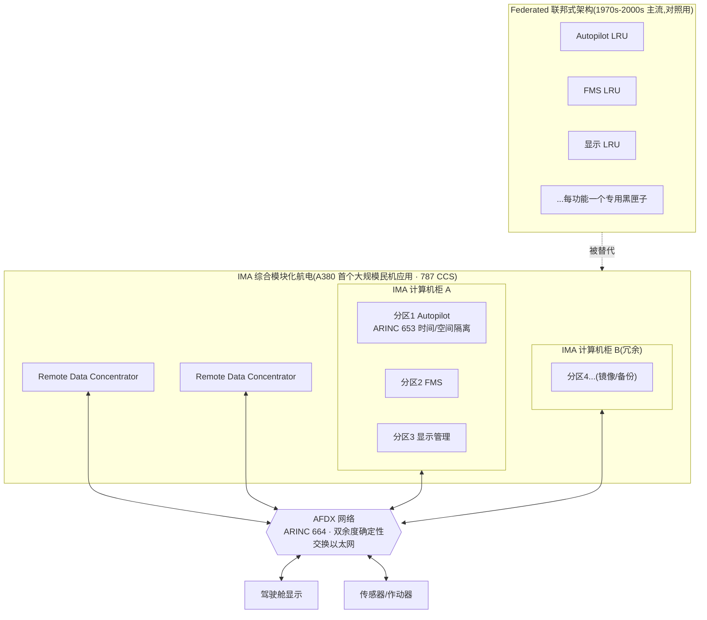
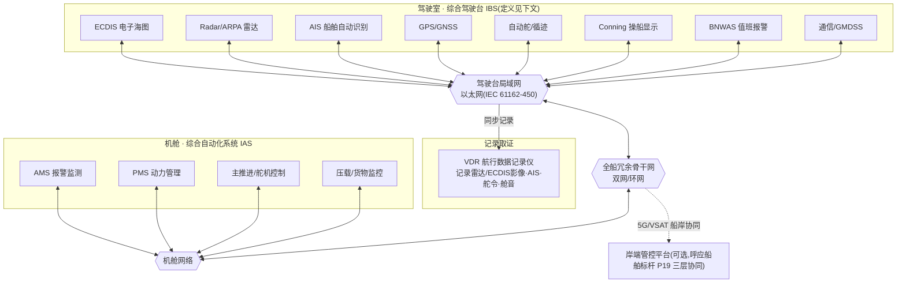
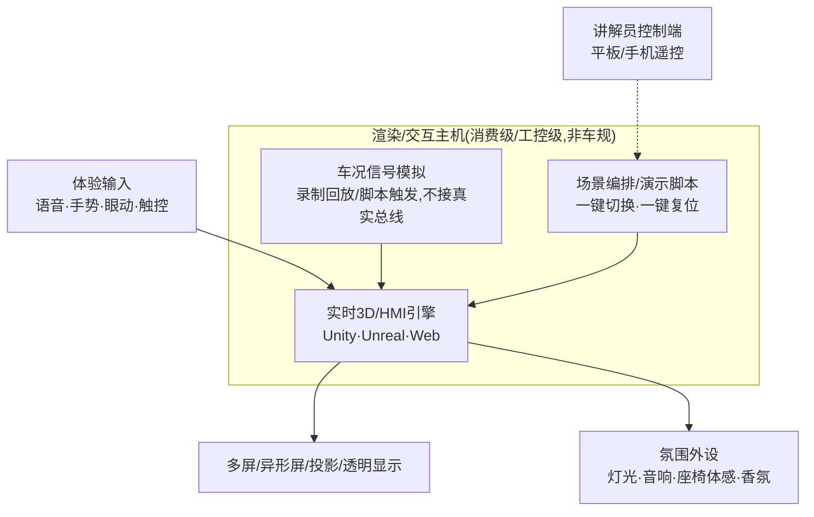
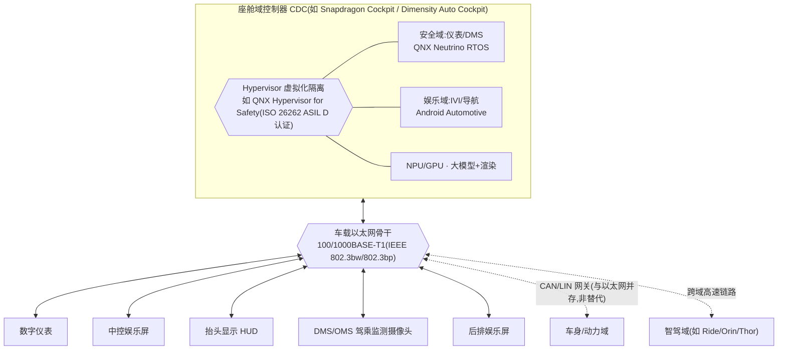

# 标杆案例 ④ · 集成化系统架构跨域知识卡片(航空 · 船舶 · 智能座舱)

> **业务领域**:跨公司两大主营(船舶智能化 / 智能座舱·展陈)的**技术架构参考层**,不对应单一客户案例。**汽车线注意**:本司交付的是**展陈/创新原型**(车展/CES 概念座舱),量产座舱域控架构在本卡仅作参照系(见 2.3 开头的分界)。
> **素材来源**:公开技术标准与行业资料的交叉研究(IMO/SOLAS、IEC、ARINC、ISO 26262 等标准文本 + 主流供应商公开产品资料),非任何客户交付物。
> **怎么用**:这是第四份标杆,性质与③造船知识卡片相近——**不讲叙事,讲"懂行的架构语言"**。给 🛠️ Sales Engineer / 📐 UX Architect / 🧭 Product Manager 三个执行**招 7 架构地图**的角色提供技术锚点,画船舶或智能座舱方案的架构图时,能讲清楚"这不是我们瞎发明的分类法,是三个高可靠性行业都验证过的同一套模式"。
> **详解版**:新人上手学习、或想深入了解案例细节与常见错误,看图更多、讲得更透的 [集成系统架构-详解手册.md](集成系统架构-详解手册.md)(含团队自检清单 + 规避低级错误清单)。

---

## 一、跨域口诀(一句话定位)

> **从「一功能一黑匣子」到「共享平台 + 软件隔离」——航空先证,船舶紧随,座舱最新。**

三个高可靠性行业,在不同年代各自走过同一条路:把"每个功能一个独立专用盒子"(航空称 federated / 联邦式;船舶称各设备独立运行;座舱称分布式 ECU)的老架构,换成"共享计算平台 + 用软件划分安全边界"的新架构。**航空最早验证这条路可行**(民用航空 1990 年代末起,安全监管最严),**船舶紧随其后**(IMO 1996 年定义综合驾驶台),**智能座舱是最新一波**(2018 年后域控制器规模化)。

> **谨慎提示**:三者是"**同一工程模式在不同行业各自独立发展**",目前没有证据表明船舶工程界在制定 IBS 标准时明确参照了航空 IMA——这是一个**可类比、但不是可考据的因果关系**。跟客户讲的时候,说"这是航空验证过几十年的同一套思路",不要说"船舶标准抄自航空标准"。

---

## 二、三域架构参考图

### 2.1 航空 · Integrated Modular Avionics(参照系,非本司业务线)

**为什么放进来**:不卖航电,但**航空是这套模式里安全监管最严、验证时间最长的行业**,是跟客户讲"这套架构思路靠谱"时最硬的信任锚点(呼应招 11)。

**关键锚点(可对客户引用)**:
- **隔离机制**:ARINC 653(APEX API)——每个软件分区独享固定 CPU 时间片 + 独立内存区,一个分区故障/崩溃不会拖垮或污染其他分区。
- **网络骨干**:ARINC 664 Part 7(AFDX)——确定性交换以太网,双余度路径 + Virtual Link 保证带宽。
- **认证体系**:DO-178C(软件设计保证等级 DAL A–E)是基础,DO-297/ED-124 是 IMA 专属补充指南(不是替代,是叠加);FAA AC 20-170 / TSO-C153 落地执行。
- **真实里程碑**:波音 777 AIMS(1995 年,算"迈向 IMA 的早期一步",非完整 IMA)→ **空客 A380(2007 年,首个大规模民机 IMA 应用)** → 波音 787 CCS(2011 年投入商业运营,GE 航电系统承制,基于 ARINC 653 兼容的 VxWorks 653)。
- 从民航规模化应用(1990s 末)算到智能座舱域控制器规模化(2018 年后),航空领先约 20–25 年——这是可以站住脚的说法,不需要往回追溯到更早的军用起源。

---

### 2.2 船舶 · Integrated Bridge System + Integrated Automation System(元启晨星业务线)

**为什么放进来**:这是元启晨星的主战场——船舶智能化方案(标杆②)里"新架构构思图"章节的技术底座,把"我们怎么组织一整套船上系统"讲清楚。

**关键锚点(可对客户引用)**:
- **IMO 对 IBS 的官方定义**:"一套互联的系统,使传感器信息或指挥控制可在工作站集中获取,目的是让合格人员更安全高效地管理船舶。"
- **失效隔离原则(SOLAS 第 V 章 第 19 条第 6 款,现行有效条款)**:综合驾驶台"任一子系统失效,必须以声光报警立即提醒当值驾驶员,且不能导致其他子系统失效;一旦某部分失效,其他设备或系统部分仍须能单独操作"——这条和航空 ARINC 653 的分区隔离是**同一条工程原则的两种行业表述**,是跨域类比里最硬的一条。
- **VDR 是"船上的黑匣子"**:客户/评委都懂这个类比,IEC 61996 系列是其性能与测试标准,由 SOLAS 第 V 章第 20 条驱动强制安装。
- **综合驾驶台的现代实现**是"可重构多功能工作站"(Multi-Function Workstation)——任何一个工作站都能调出雷达/ECDIS/Conning/传感器画面,这是"任务站"(task station)概念的落地。
- **真实供应商参照**(用于佐证"这是行业成熟做法,不是我们杜撰的分类"):Kongsberg Maritime 的 **K-Bridge**(驾驶台/导航)+ **K-Chief 600**(综合自动化,含报警监测/动力管理);Anschütz 的 **Synapsis NX**(驾驶台系统)。
- **和船舶标杆②的呼应**:中国船级社(CCS)现行的《智能船舶规范》(2024)已把"综合驾驶台"列为"智能集成平台"的核心实现载体之一——这与标杆②船舶方案里"全国首个获 CCS 原则性认可"这一差异化身份是同一套认证体系,讲方案时可以互相印证。

---

### 2.3 智能座舱 · 展陈原型与量产域控(智能座舱/展陈业务线)

**先分清(本节最重要的一句)**:本司汽车线交付的是**座舱创新原型/展陈体验**——车展、CES 上的概念座舱(华翔 NICE 这类),与太空舱标杆①同一谱系;**不交付量产域控**。图一是我们交付的世界;图二是客户量产团队生活的世界——懂图二是为了听懂客户语言、把原型挂上客户路线图、并且不越界承诺。

**图一 · 我们交付的:展陈/创新原型座舱**

**关键锚点 · 原型侧(我们交付什么)**:
- 架构核心 = **实时引擎 + 场景编排 + 信号模拟**,硬件用消费级/工控级——不背车规包袱,正是"又快又惊艳"的来源,是特性不是缺陷。
- 展陈特有构件别漏:**讲解员控制端、一键切换/一键复位、脚本化车况数据**——现场演示"每一遍都稳定复现"靠的是这些。
- 表达范例:太空舱标杆①的"一舱一域一环境三端"就是这类原型的招 7 口诀范本。

**图二 · 参照系:量产座舱域控(客户量产团队的世界)**

**关键锚点 · 量产侧(参照,听懂客户语言用)**:
- **legacy 架构**:仪表、中控娱乐、HUD、后排娱乐各自一颗专用 MCU、各自布线——和航空的"federated"、船舶的"各设备独立"是同一种老模式。
- **隔离机制**:Hypervisor 把安全域(仪表/DMS,实时性与功能安全要求高)和娱乐域(IVI,功能丰富但容错要求低)隔离在同一颗 SoC 上——**QNX Hypervisor for Safety** 已通过 ISO 26262 ASIL D 认证,原理上对应航空的 ARINC 653 分区、船舶的 SOLAS 失效隔离条款。
- **真实量产案例**(最贴合"一颗芯片多系统"的例子):**佛吉亚旗下东软睿驰 PATEO CONNECT+**,基于高通 SA8155 芯片 + QNX Hypervisor,QNX 侧跑仪表/DMS/自动泊车算法,Android 侧跑车机娱乐,已在岚图、哪吒等多家车企 10+ 车型量产。
- **网络骨干**:车载以太网(100BASE-T1/1000BASE-T1)承载摄像头与多屏高带宽数据;CAN/LIN 并未被取代,而是在低速车身域继续与以太网并存。
- **跨域集成新趋势**:蔚来"Adam"中央计算平台(高通 SA8295P 座舱芯片 + 4 颗英伟达 Orin-X)、高通 2026 年 CES 展示的座舱+智驾双芯片跨域方案,代表座舱域正在和智驾域进一步融合——这是三个行业里**最新、还在快速演进**的一段。

**边界提醒(必须说在前面)**:原型没走车规(AEC-Q100)、没做 ISO 26262 ASIL、没进量产认证周期——对客户主动讲"**原型验证体验,量产另行工程化**",划清边界反而显得懂行;"我们这套可以直接上车"是汽车线最典型的越界翻车话术。

---

## 三、跨域对比表(讲给客户听的"一张表")

| 维度 | 航空 Avionics(参照) | 船舶 Marine(元启晨星业务线) | 智能座舱 Automotive(展陈线;量产=参照) |
|---|---|---|---|
| 规模化年代 | 1990s 末(777 AIMS)→ 2007(A380)→ 2011(787) | 1996 IMO 定义 IBS → 2000s 普及 | 2018 起(座舱 SoC)→ 2020s 主流 |
| legacy 架构 | Federated(一功能一 LRU) | 各设备独立运行 | 分布式 ECU(一屏一芯片) |
| 整合后架构 | IMA 综合模块化航电 | IBS 综合驾驶台 + IAS 综合自动化 | 座舱域控制器 CDC |
| 隔离/安全机制 | ARINC 653 时间/空间分区 | SOLAS V/19.6:一部分故障不得连累其他部分 | Hypervisor(如 QNX,ASIL D 认证) |
| 网络骨干 | AFDX(ARINC 664,双余度确定性以太网) | IEC 61162-450(以太网) | 车载以太网 100/1000BASE-T1 |
| 权威标准/规则 | DO-297/ED-124,FAA AC 20-170 | IMO SOLAS 第 V 章,IEC 61924-2 / 61996 | ISO 26262(freedom from interference) |
| 真实参照 | A380 · 波音 787 CCS | Kongsberg K-Bridge+K-Chief · Anschütz Synapsis NX | PATEO CONNECT+(SA8155+QNX)· 蔚来 Adam |
| **本司交付形态** | 不交付(纯信任锚点/参照) | 方案与系统交付(主营业务线) | **展陈/创新原型**交付(车展/CES);量产域控仅为参照系 |

---

## 四、怎么在方案里用(对应招 7 架构地图)

- **执行者**:🛠️ Sales Engineer(把客户系统现状套进这张参照表,找出"哪块还是 legacy、哪块可以整合")+ 📐 UX Architect(把整合后架构画成客户看得懂的图,参考本卡四张 Mermaid 图的分层方式)+ 🧭 Product Manager(用跨域参照佐证产品路线图不是拍脑袋)。
- **落地位置**:船舶方案的"技术架构"章节(对应标杆②船舶方案 P19)、智能座舱方案的"一舱一域一环境三端"技术主体章节。
- **怎么讲给客户**:不要堆图(反面教材,见招 7 卡片),而是用**一张跨域对比表 + 一句口诀**先立住"这是被验证过的模式",再展开自家系统的整合架构图——航空/船舶栏目里的例子只作**信任锚点**引用,不代表本司交付这些系统。
- **汽车线定位**:给车企/Tier1 讲展陈原型方案时,量产架构知识只干两件事——把原型的体验点挂上客户的量产路线图(招 5 升维),以及主动划清"原型≠量产"的边界(见 2.3 边界提醒)。

---

## 五、引用提醒(标准编号谨慎使用)

部分 IMO/IEC 决议存在**修订/废止**历史(例如 IMO MSC.64(67) 附件一已被 SN.1/Circ.288 取代;VDR 相关 IMO 决议前后历经 A.861(20)→MSC.163(78)→MSC.333(90)→MSC.494(104) 多次修订)。**正式投标/合规文件引用具体标准编号或条款前,务必核对现行有效版本**——本卡的编号用于说明"这类标准体系真实存在、分工明确",不作为合规依据直接引用。

---

## 六、可补进招式库的候选新要点(待 02 收录)

| 候选要点 | 一句话 | 与既有招式关系 |
|---|---|---|
| **跨行业精度锚定** | 用监管更严的行业(航空)的成熟架构模式佐证本行业新架构可靠,而非自证 | 架构地图(招7)的可信度增强变体;呼应招11信任锚点 |

---

*(知识卡片 v1.0。素材为公开技术标准与行业公开资料的交叉研究提炼,不含任何客户交付物;标准编号与年代经多来源交叉核对,已知的修订/废止历史见第五节。)*
