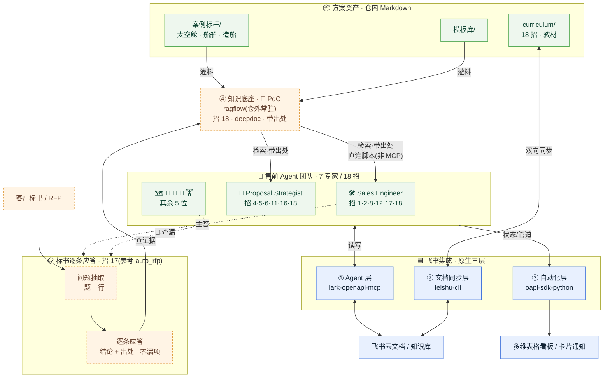

# 飞书打通 · 集成工程

> 把这套**售前方案产线**与飞书深度打通,**①–③ 为飞书原生三层**(共用一份凭证 [`.env.example`](.env.example),互不依赖,可单独启用);**④ 知识底座为可选扩展**(仓外常驻的 ragflow,目前 🧪 PoC,见 [`04-knowledge-base/`](04-knowledge-base/))。
>
> 面向**新人**的"该叫哪个 Agent、连飞书的什么能力"对照,见 [`curriculum/05-飞书打通-使用手册.md`](../curriculum/05-飞书打通-使用手册.md)。

## 三层架构(一图看懂)

```
                售前 Agent 团队(7 个专家)
                          │
   ┌──────────────────────┼──────────────────────┐
   ▼                      ▼                      ▼
① Agent 层             ② 文档同步层            ③ 自动化层
lark-openapi-mcp       feishu-cli             官方 Python SDK
(官方 MCP)            (Markdown↔云文档)      (通知 + 多维表格看板)
   │                      │                      │
   ▼                      ▼                      ▼
Agent 直接读写飞书     方案/教材 ↔ 云文档       管道看板 / 卡片通知
云文档·多维表格·消息   知识库 双向无损同步      审批 / 复盘库
```

| 层 | 目录 | 上游仓库 | 解决什么 |
|---|---|---|---|
| ① Agent 层 | [`01-agent-mcp/`](01-agent-mcp/) | [larksuite/lark-openapi-mcp](https://github.com/larksuite/lark-openapi-mcp)(官方,⭐742) | 让 7 个 Agent **原生操作**飞书云文档/多维表格/消息 |
| ② 文档同步层 | [`02-doc-sync/`](02-doc-sync/) | [riba2534/feishu-cli](https://github.com/riba2534/feishu-cli)(社区,⭐1.2k) | 方案与教材 **Markdown ↔ 飞书云文档**双向无损同步 |
| ③ 自动化层 | [`03-automation/`](03-automation/) | [larksuite/oapi-sdk-python](https://github.com/larksuite/oapi-sdk-python)(官方,⭐525) | 方案状态 **→ 机器人卡片通知**;销售管道 **→ 多维表格看板** |
| ④ 知识底座(🧪 PoC) | [`04-knowledge-base/`](04-knowledge-base/) | [infiniflow/ragflow](https://github.com/infiniflow/ragflow)(开源,⭐83k) | 把 `案例标杆/`·`模板库/` 沉淀成**可检索、带出处**的知识库([招 18](../curriculum/02-方法论-招式卡片.md));**仓外常驻**,网页版下走第③层式直连脚本 |

> **定时 CI**:[`.github/workflows/feishu-sync.yml`](../.github/workflows/feishu-sync.yml) 每周一自动把教材推到飞书知识库(基于第②层,幂等更新)。配置见 [`02-doc-sync/README.md`](02-doc-sync/README.md) 的「定时同步到知识库」。

## 全景总图(产线 × 四层 × 外部工作流)

> 一张图看清:**仓内资产**(绿)如何经**飞书四层**(蓝=原生三层)流动,以及第 ④ 层 **ragflow 知识底座**与**标书逐条应答**两条外部工作流(橙色虚线=仓外/PoC)如何接入。



**怎么读这张图**

- **两条主数据流**:① `案例标杆/`·`模板库/` →(灌料)→ **ragflow** →(检索·带出处)→ SE/Strategist 引用(**招 18**);② 客户标书 →(问题抽取→逐条应答)→ 回查 ragflow 取证据(**招 17**)。
- **颜色 = 边界**:绿 = 仓内 Markdown 资产;蓝 = 飞书**原生三层**(开箱即用);**橙色虚线 = 仓外常驻 / PoC**(ragflow 与标书应答工作流)。
- **网页版关键**:橙色那条 `④→SE` 标了 **「直连脚本(非 MCP)」**——这是网页版下唯一稳妥的接法(见 [`04-knowledge-base/`](04-knowledge-base/) §1-2)。
- **auto_rfp 的定位**:它不是要部署的服务,而是**招 17 工作流的参考蓝本**(问题抽取→RAG→带出处应答),在图中体现为「标书逐条应答」子图。

## 快速开始(5 步)

1. **建应用**:飞书开放平台创建企业自建应用,拿到 `App ID` / `App Secret`。
2. **配凭证**:`cp feishu/.env.example feishu/.env`,填入凭证。
3. **开权限**:在应用后台开通所需权限(各层 README 列了最小权限集),发布版本。
4. **挑层启用**:
   - 要让 Agent 直接干活 → 看 [`01-agent-mcp/README.md`](01-agent-mcp/README.md)
   - 要同步方案/教材 → 看 [`02-doc-sync/README.md`](02-doc-sync/README.md)
   - 要通知/看板 → 看 [`03-automation/README.md`](03-automation/README.md)
5. **拉机器人进群**:把应用机器人加入目标群,用 `python feishu/03-automation/list_chats.py`(或 `feishu-cli msg search-chats --query "<群名>"`)取 `chat_id` 回填 `.env`。

## 安全约定

- **凭证只进 `.env`,永不入库**(已在根 [`.gitignore`](../.gitignore) 屏蔽)。仓库里凡是 `*.example.*` 都是脱敏模板。
- MCP 默认用 `tenant_access_token`(应用身份)。需要"以本人身份"读写个人文档时,才按 ① 层文档切到 OAuth 用户态。
- 给应用**最小权限**:只开各层 README 列出的 scope,不要图省事开全量。
