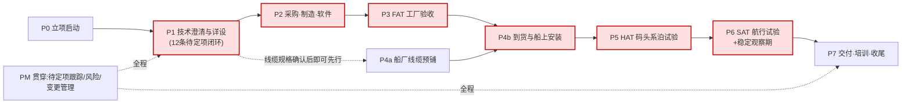

# 武汉东湖智能游艇示范项目 · 完整项目任务清单

| 项目 | 内容 |
|---|---|
| 项目名称 | 阳新县仙岛湖 · 武汉东湖智能游艇示范项目 |
| 系统范围 | 驾控台(主/副)及智控系统 |
| 甲方 | 武船设计院 / 中南彭力 |
| 乙方 | 无疆(武汉)技术有限公司 |
| 文档定位 | 依据《驾控台及智控系统-技术方案-V2-对标升级版》梳理的**全生命周期任务清单**(WBS),覆盖立项→技术澄清→制造→FAT→安装→HAT→SAT→交付八个阶段 + 贯穿性项目管理任务;每条任务标注交付物、责任方、前置依赖与是否在关键路径上 |
| 任务来源 | V2 第八章 12 条待定项、第 4.4 节失效场景、第九章 FAT/HAT/SAT 验收框架、第十/十一章可选建议项、外装安装示意图、技术协议交付条款;每条任务在"来源"列标注出处 |
| 使用方式 | 按周例会逐条核销;"关键路径=是"的任务一旦延误直接拖累交船,优先保障;标注〔可选〕的任务需甲方先决策是否实施,不默认计入工期 |
| 版本 | V1.0(随 V2 技术方案发布) |

---

## 一、阶段与关键路径总览

### 1.1 阶段依赖图

### 1.2 里程碑一览

| 里程碑 | 定义(完成标准) | 前置依赖 |
|---|---|---|
| M0 合同生效 | 技术协议双方签字(注:现协议签字页尚为空白) | — |
| M1 详设冻结 | 12 条待定项中影响关键路径的 7 条全部闭环;正式接线图+认可图甲方会签;检试大纲会签 | M0 |
| M2 出厂就绪 | 台体+配盘+软件完成,FAT 六项全部通过,合格证/出厂报告齐套 | M1 |
| M3 安装完成 | 船厂预铺线缆+外装设备+驾控台就位+机舱侧对接全部完成 | M2(预铺可提前) |
| M4 系泊通过 | HAT 五项(含失效注入)全部通过 | M3 |
| M5 航行通过 | SAT 三项通过 + 吊舱映射标定完成 | M4 |
| M6 交付验收 | 稳定观察期达标,五方清点签字,培训与随机文件交付完成 | M5 |

> **关键路径主链**:T1.14 正式接线图 → T2.3 电气配盘 → P3 FAT → T4.8 驾控台就位 → P5 HAT → P6 SAT → M6。其中 T1.1(副台面板澄清)、T1.4(上行总线)、T1.5(手柄供电)三条澄清任务**直接卡住 T1.14 出图**,是当前最优先事项。

---

## 二、P0 · 立项启动

| 编号 | 任务 | 交付物/完成标准 | 责任方 | 前置 | 关键路径 | 来源 |
|---|---|---|---|---|---|---|
| T0.1 | 技术协议签署(现签字页空白,日期未填) | 双方签字盖章版协议 | 双方 | — | 是 | 协议封面页 |
| T0.2 | 建立项目组与联络矩阵(设计/电气/软件/商务对口人) | 联络人清单 | 双方 | T0.1 | 否 | 项目管理惯例 |
| T0.3 | 编制基线计划(套用 `curriculum/模板库/关键路径日历.md`,填入实际日期) | 带日期的里程碑日历 | 无疆 | T0.1 | 是 | 模板库 |
| T0.4 | "智控"能力边界口径统一(对外话术:电子遥控+闭环跟随,非自主决策) | 对外沟通口径备忘 | 无疆+销售 | T0.1 | 否 | V2 零章/风险#5 |

---

## 三、P1 · 技术澄清与详细设计(12 条待定项闭环)

> 本阶段任务多数来自 V2 第八章待定项登记,编号后括注对应待定项序号。**T1.1/T1.4/T1.5 卡住正式接线图出图,优先闭环。**

| 编号 | 任务 | 交付物/完成标准 | 责任方 | 前置 | 关键路径 | 来源 |
|---|---|---|---|---|---|---|
| T1.1 | 澄清副驾控台"控制面板"范围(设备清单与"不带按键面板"注释矛盾) | 书面确认的副台面板元器件清单 | 无疆+设计院 | T0.1 | **是** | 待定项#1 |
| T1.2 | 确认智控→手动**退出条件**(是否需转速归零) | 写入详设的切换条件规格 | 无疆+甲方 | T0.1 | **是** | 待定项#2 |
| T1.3 | 确认控制接线板/动力转向系统"3 套"的数量构成 | 供货清单明细确认 | 双方 | T0.1 | 否 | 待定项#3 |
| T1.4 | 明确 ICC/IGS 采集单元上行总线介质(CAN / 以太网 / Modbus TCP 逐台标注) | 上行总线分配表 | 无疆 | T0.1 | **是** | 待定项#4 |
| T1.5 | 确认推进手柄、电子方向机是否独立供电 | 供电方案确认单 | 无疆 | T0.1 | **是** | 待定项#5 |
| T1.6 | 确认惯导馈线(标准10m)/雷达通信线(标准4m)实际长度 | 线缆长度清单(超长部分另行备货) | 船厂测量+无疆 | T0.1 | 否 | 待定项#6 |
| T1.7 | 动态声呐安装位置现场踏勘 + 安装支架方案 | 踏勘纪要+支架图纸(支架需提前制作) | 无疆+船厂 | T0.1 | 否 | 待定项#7;安装图P8 |
| T1.8 | 确认总用泵启停/运行状态、舵角传感器是否配置(若无删减端子) | 端子取舍确认单 | 甲方 | T0.1 | 否 | 待定项#9 |
| T1.9 | 显控屏端口级信号分配(惯导落左/右屏哪路 CAN/串口等) | 端口分配表 | 无疆 | T1.4 | 否 | 待定项#10 |
| T1.10 | 编制出厂检试大纲:按 V2 第九章 FAT/HAT/SAT 框架细化并**与甲方会签**(解决协议仅 2 项验收、"△"含义不明问题) | 会签版检试大纲 | 双方 | T0.1 | **是** | 待定项#11;V2 九章 |
| T1.11 | 〔可选〕网络安全网关实施决策(4G 上云通道现状无鉴权) | 甲方书面决策(本期实施/暂缓) | 甲方 | T0.1 | 否 | 待定项#12;V2 十一章 |
| T1.12 | 失效场景行为规格评审:V2 §4.4 六条(CAN中断/VCU死机/惯导失锁/4G断网/智控丢包/仲裁异常)写入详设并定超时阈值 | 失效行为规格书(评审通过) | 无疆 | T1.4 | **是** | V2 §4.4 |
| T1.13 | 〔可选〕告警三级分层(P0/P1/P2)清单评审 | 告警分级映射表 | 无疆+甲方 | T0.1 | 否 | V2 §10.1 |
| T1.14 | 出**正式接线图 + 台体认可图**(造型/颜色/尺寸/排布),提交甲方会签 | 会签版图纸(M1 冻结) | 无疆 | T1.1,T1.4,T1.5 | **是** | 协议§3.1;V1 待定项 |
| T1.15 | 〔可选〕轻量健康评分是否实施决策 | 甲方书面决策 | 甲方 | T1.13 | 否 | V2 §10.2 |

---

## 四、P2 · 采购、制造与软件

| 编号 | 任务 | 交付物/完成标准 | 责任方 | 前置 | 关键路径 | 来源 |
|---|---|---|---|---|---|---|
| T2.1 | 长周期物料下单(显控屏×4、惯导、声呐、毫米波雷达、NVR+摄像头、交换机、采控单元等,按第六章 BOM) | 采购订单+到货计划 | 无疆 | T1.14 | **是** | V2 六章 |
| T2.2 | 驾控台台体制造(碳纤维、白+金、IP44、约1000×1200×500mm,以认可图为准) | 主/副台体完工 | 无疆 | T1.14 | **是** | 协议§2.1 |
| T2.3 | 主驾控台电气配盘与内部接线(按框图 V1.1 + Excel 接线清单逐条) | 配盘完工+自检记录 | 无疆 | T2.1,T2.2 | **是** | 框图P1;Excel |
| T2.4 | 副驾控台配盘(按 T1.1 澄清后的面板清单;VCU-副+DC/DC+急停+双屏) | 副台配盘完工 | 无疆 | T1.1,T2.1 | **是** | 框图P2 |
| T2.5 | 显控软件开发/配置:双屏页面、报警上屏、权限切换 UI;〔可选〕告警分级、健康评分(依 T1.13/T1.15 决策) | 软件版本+功能清单 | 无疆 | T1.9,T1.12 | **是** | V2 五/十章 |
| T2.6 | VCU 逻辑实现与台架联试:主副权限仲裁(手柄回空挡互锁)、INT/EXT 模式切换、§4.4 失效行为 | 台架联试记录 | 无疆 | T1.12,T2.3,T2.4 | **是** | V2 §4.1-4.4 |
| T2.7 | 〔可选〕网络安全网关采购与配置(依 T1.11 决策) | 网关设备+白名单配置 | 无疆 | T1.11 | 否 | V2 十一章 |
| T2.8 | 随机文件编制:中文手册、原理图(塑封/铜板,随控制箱)、接线图(端子编号) | 随机文件初稿 | 无疆 | T1.14 | 否 | 协议§1.6.7 |

---

## 五、P3 · FAT 工厂验收(对应检试大纲 9.1)

| 编号 | 任务 | 交付物/完成标准 | 责任方 | 前置 | 关键路径 | 来源 |
|---|---|---|---|---|---|---|
| T3.1 | 外观检查(台体无损伤、IP44、颜色铭牌符合认可图) | 检验记录 | 无疆(甲方可到场) | T2.3,T2.4 | 是 | 协议§4.1 |
| T3.2 | 电气性能检查(绝缘/耐压/接地,符合 CCS) | 出厂测试报告 | 无疆 | T2.3 | 是 | 协议§4.1 |
| T3.3 | 双路供电切换测试(AC220/DC24 任一失电无缝切换+报警上屏) | 测试记录 | 无疆 | T2.3,T2.5 | 是 | V2 9.1#3 |
| T3.4 | 急停多点串联台架测试(主/副/扩展任一触发→双推进停,不经 VCU 生效) | 测试记录 | 无疆 | T2.3,T2.4 | 是 | V2 9.1#4 |
| T3.5 | CAN 总线稳定性测试(振动/温度下三路 CAN 无丢包误码) | 测试记录 | 无疆 | T2.6 | 是 | V2 9.1#5 |
| T3.6 | 邀请甲方出厂试验见证;合格证+出厂试验报告齐套 | 甲方见证签字(如到场)+文件包 | 双方 | T3.1–T3.5 | 是 | 协议§4.2/§3.4 |
| T3.7 | 包装发运(GB/T 13384,防潮防震,标注吊点,电缆口密封) | 发货单+包装照片 | 无疆 | T3.6 | 是 | 协议§3.3/§5 |

---

## 六、P4 · 船厂预铺与船上安装

> **T4.1 线缆预铺不依赖 FAT,确认线缆规格(T1.6)后即可先行开工**——这是把船厂工序从关键路径上解耦的关键动作。

| 编号 | 任务 | 交付物/完成标准 | 责任方 | 前置 | 关键路径 | 来源 |
|---|---|---|---|---|---|---|
| T4.1 | 船厂线缆预铺:摄像头 6 类网线×5、CAN 定制线(推进+直流板)、电池网线、音频线(双股金银 0.95²)、急停开关线(4 根,自制) | 预铺完成+通断测试 | 船厂 | T1.6 | **是** | Excel 无疆接线;安装图 |
| T4.2 | 惯导天线×2 安装(船顶开阔区、间距 1.5m、开孔 ∅147.5mm、嵌入需 100mm 深度、打胶固定) | 安装完成+馈线接入驾控台 | 船厂+无疆指导 | T4.1,T3.7 | 是 | 安装图P2 |
| T4.3 | 毫米波雷达安装(船头、正面无遮挡、嵌入式;亚克力装饰需与发射面贴合) | 安装完成 | 船厂+无疆指导 | T4.1,T3.7 | 是 | 安装图P3 |
| T4.4 | 语音喇叭安装(开孔 ∅130mm;扩展喇叭最多 2 个,位置确认) | 安装完成 | 船厂 | T4.1 | 否 | 安装图P4;框图注7 |
| T4.5 | 摄像头×5 + NVR + 边缘计算盒安装(POE 供电,支架无疆提供) | 安装完成+图像可见 | 船厂+无疆 | T4.1,T3.7 | 是 | 安装图P5 |
| T4.6 | 后甲板急停开关安装(∅22mm 开孔,两对常闭,与驾控台急停**串联**接线) | 安装完成+回路导通记录 | 船厂 | T4.1 | 是 | 安装图P6;V2 5.11 |
| T4.7 | 动态声呐安装(按 T1.7 支架方案;**通电前必须完全浸水**,写入施工交底) | 安装完成+施工交底签字 | 船厂+无疆 | T1.7,T3.7 | 否 | 安装图P8;协议§2.2.6 注意事项 |
| T4.8 | 主/副驾控台吊装就位、底部螺栓固定、底部进线、机舱侧对接(推进控制箱/直流板/电池箱/风机) | 就位+全部端子对接完成 | 船厂+无疆 | T3.7,T4.1 | **是** | 协议§2.1;Excel |

---

## 七、P5 · HAT 码头/系泊试验(对应检试大纲 9.2)

| 编号 | 任务 | 交付物/完成标准 | 责任方 | 前置 | 关键路径 | 来源 |
|---|---|---|---|---|---|---|
| T5.1 | 报警与数采链路逐点测试(液位/舱底水/SOC/失电等逐点触发,时延达标上屏) | 逐点测试表 | 无疆+船厂 | T4.8 | 是 | V2 9.2#7 |
| T5.2 | 视频/声呐/雷达功能测试(5 路视频可回放、声呐成像、雷达 40m 预警) | 测试记录 | 无疆 | T4.5,T4.7,T4.3 | 是 | V2 9.2#8 |
| T5.3 | 4G/5G 船岸通信测试(数据上云、岸端可实时获取;若实施网关则含白名单验证) | 测试记录 | 无疆 | T4.8,T2.7 | 是 | V2 9.2#9 |
| T5.4 | 双驾控台权限切换测试(回空挡可切换、未回空挡拒绝) | 测试记录 | 无疆 | T4.8 | 是 | V2 9.2#10 |
| T5.5 | **失效场景注入测试**(按 §4.4 逐条:拔 CAN、断 VCU 电、遮惯导、断 4G,验证确定性应对) | 故障注入测试报告 | 无疆 | T5.1,T1.12 | 是 | V2 9.2#11 |

---

## 八、P6 · SAT 航行试验 + 稳定观察(对应检试大纲 9.3/9.4)

| 编号 | 任务 | 交付物/完成标准 | 责任方 | 前置 | 关键路径 | 来源 |
|---|---|---|---|---|---|---|
| T6.1 | 吊舱 0-330° 回转角与方向盘圈数**映射标定**(实测写入闭环参数) | 标定参数记录 | 无疆 | P5 全部 | 是 | 待定项#8 |
| T6.2 | 智控/手动切换航行实测(切入条件:转速归零+吊舱归位;退出条件按 T1.2 验证) | 测试记录 | 无疆+甲方 | T6.1,T1.2 | 是 | V2 9.3#12 |
| T6.3 | 应急舵接管测试(模拟转舵失效,人员随时接管) | 测试记录 | 无疆+船厂 | T6.1 | 是 | V2 9.3#13 |
| T6.4 | 稳定观察期:基础链路稳定运行 ≥30 天,关键报警链路可用度 ≥99%(具体口径按 T1.10 大纲) | 运行日志+可用度统计 | 双方 | T6.2 | 是 | V2 9.4 |

---

## 九、P7 · 交付、培训与收尾

| 编号 | 任务 | 交付物/完成标准 | 责任方 | 前置 | 关键路径 | 来源 |
|---|---|---|---|---|---|---|
| T7.1 | 随机文件定稿交付(中文手册、功能原理图含端子编号、接线图、系统手册) | 文件包签收 | 无疆 | T6.4 | 是 | 协议§1.6.7 |
| T7.2 | 免费技术指导与操作培训(甲方/船东/船厂),按需参加系泊/航行试验报验 | 培训签到+纪要 | 无疆 | T6.2 | 否 | 协议§8 |
| T7.3 | as-built 图纸回灌(把联调实测的端口分配/标定参数更新进正式图,替换方案中的示意图) | as-built 版图纸 | 无疆 | T6.4 | 否 | V2 十三章#4 |
| T7.4 | 货物/系统五方清点验收签字(甲方、船东、船厂、设计院、设备商) | 验收签字单 | 五方 | T7.1 | 是 | 协议§6 |
| T7.5 | 项目复盘(可召唤 🏋️ Sales Coach 按复盘流程执行,沉淀进案例库) | 复盘纪要 | 无疆 | T7.4 | 否 | 仓库流程篇 |

---

## 十、PM · 贯穿性项目管理任务

| 编号 | 任务 | 节奏 | 责任方 | 来源 |
|---|---|---|---|---|
| TM.1 | 待定项跟踪:V2 第八章 12 条逐条指派负责人+闭环时间,周会核销 | 每周 | 双方 PM | V2 八章 |
| TM.2 | 风险登记维护:V2 表 B 的 5 条风险动态更新,新风险随时入表 | 每周 | 无疆 PM | V2 八章表B |
| TM.3 | 变更管理:设计/工艺更改书面告知甲方并取得认可,工作图变更附书面说明 | 事件驱动 | 无疆 | 协议§3.1(b) |
| TM.4 | 可选项决策跟踪:T1.11(网关)、T1.13(告警分级)、T1.15(健康评分)三项甲方决策的截止提醒——**逾期未决策默认按"本期不实施"处理并书面留痕** | 里程碑 M1 前 | 双方 PM | V2 十/十一章 |
| TM.5 | 关键路径周报:主链(接线图→配盘→FAT→安装→HAT→SAT)各环节偏差与追赶措施 | 每周 | 无疆 PM | 本清单 §1.2 |

---

## 十一、任务统计与使用说明

| 阶段 | 任务数 | 其中关键路径 | 其中可选(待甲方决策) |
|---|---|---|---|
| P0 立项启动 | 4 | 2 | 0 |
| P1 技术澄清与详设 | 15 | 6 | 3(网关/告警分级/健康评分) |
| P2 采购制造软件 | 8 | 6 | 1(网关配置) |
| P3 FAT | 7 | 7 | 0 |
| P4 预铺与安装 | 8 | 6 | 0 |
| P5 HAT | 5 | 5 | 0 |
| P6 SAT+观察期 | 4 | 4 | 0 |
| P7 交付收尾 | 5 | 3 | 0 |
| PM 贯穿 | 5 | — | — |
| **合计** | **61** | **39** | **4** |

**三条使用提醒**:

1. **当前最优先**:T1.1(副台面板)、T1.4(上行总线)、T1.5(手柄供电)三条澄清任务卡住正式接线图(T1.14),接线图又是整条关键路径的起点——本周就该发出澄清函。
2. **可并行提效**:船厂线缆预铺(T4.1)只依赖线缆规格确认(T1.6),不必等 FAT;尽早启动可把船厂工序移出关键路径。
3. **可选项止损**:三个〔可选〕决策(网关/告警分级/健康评分)设定决策截止日=M1 详设冻结;逾期默认不实施并书面留痕,避免后期插入返工。
