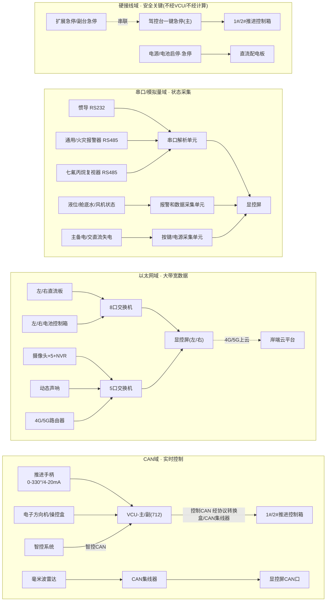
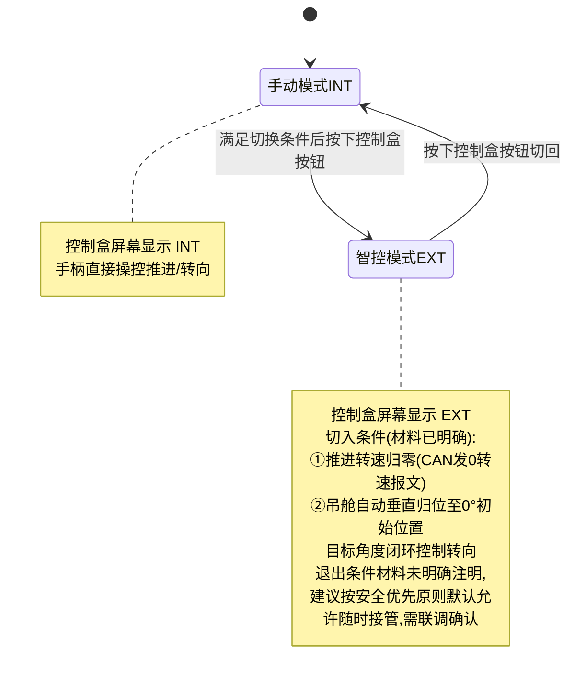
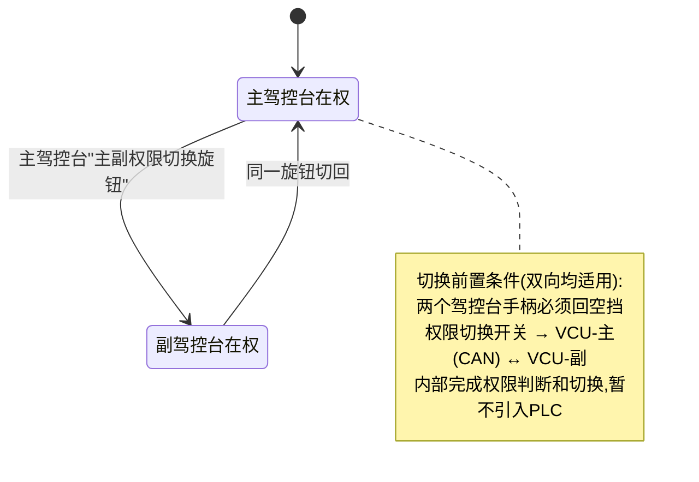
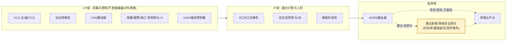

# 武汉东湖智能游艇示范项目 · 驾控台及智控系统技术方案(V2 · 对标升级版)

| 项目 | 内容 |
|---|---|
| 项目名称 | 阳新县仙岛湖 · 武汉东湖智能游艇示范项目 |
| 系统范围 | 驾控台(主/副)及智控系统 |
| 甲方 | 武船设计院 / 中南彭力 |
| 乙方 | 无疆(武汉)技术有限公司 |
| 船型配置 | 1 条船 · 2×40kW 吊舱推进 · 357kWh 电池(2 仓) · 双驾控台(驾驶室+飞桥) |
| 依据材料 | ①驾控台及智控系统技术协议 V1.0 ②驾控台相关电气配盘和设备接线说明 V1.1 ③无疆外装设备安装示意图 ④驾控台相关接线定义清单(Excel) ⑤《智航·船端智能一体化平台核心产品技术方案》V1.0(对标参照,不属于本项目供货依据) |
| 与 V1 的关系 | V1(`驾控台及智控系统-技术方案.md`)是原始详设文档,内容完整保留、未删改;**V2 在 V1 基础上新增 4 章、升级 2 章**,所有新增内容均标注"是否需要新增硬件",详细对标依据见同目录《智航对标-差异化分析.md》 |
| 文档定位 | 内部技术架构与实施方案(工程/详设向)。第零章为新增的能力对标定位说明 |
| 版本 | V2.0 |

---

## 零、能力对标定位(新增)

> 本章为 V2 新增,目的是**诚实定位**本项目在行业标杆坐标系中的位置,避免"智控系统"这一命名引发能力误判。详细逐维度对比见《智航对标-差异化分析.md》,此处只给结论。

对标《智航·船端智能一体化平台》的两大能力支柱划分:

| 支柱 | 智航定义 | 本项目状态 |
|---|---|---|
| 支柱一 · 船舶智能人机交互 | AI-IoT 数据底座 + 智慧驾控台,"设备到数据、数据到人机" | **本项目对应此支柱的一个小型单船落地案例**,技术路线方向一致,规模与文档正式程度存在差距(详见第七、九、十、十一章升级) |
| 支柱二 · 船舶智能驾驶 | 多源融合感知 + 自主决策控制,"数据到自主、船岸协同" | **本项目不具备,也不宣称具备**。现有"智控"准确定义为"电子遥控 + 闭环跟随",不涉及路径规划、避障或风险评分;如需演进,属于全新立项,见第十二章"能力路线图" |

**本项目的独有优势**:双驾控台(主/副)对等冗余 + 双 VCU 权限仲裁架构,是智航 48 页材料未涉及的场景(单驾控台设计),详见第二章。

---

## 一、项目概述

### 1.1 一句话定位

> 一套**双驾控台(主/副对等冗余) + 双 VCU 权限仲裁 + 8 类采控单元 + 四总线骨架**的智能游艇驾驶舱,把推进/电池/导航/视频/报警/应急六大船载子系统汇聚到双屏,支持**手动/智控双模、主/副台双站、电子/物理双通道、供电/急停双冗余**。定位为船舶智能人机交互能力的单船示范落地(对应行业平台方案的"支柱一"),不含自主航行决策能力。

### 1.2 船型与配置速记

| 维度 | 参数 |
|---|---|
| 推进型式 | 2 × 吊舱推进器,单台 40kW,回转角 0–330° |
| 电池 | 357kWh,2 个电池仓(左/右) |
| 日用电源 | DC24V |
| 驾控台数量 | 2 个:主驾控台(驾驶室,室内) + 副驾控台(飞桥,室外) |
| 手柄型式 | 712 手柄:CAN + 模拟量 |
| 推进急停 | 硬接线,不经 VCU |
| 电池/推进通信 | CAN |
| 报警与数采 | 淡水箱×1(模拟量)、黑水箱×2(模拟量)、舱底水高位×6(开关量) |
| 报警设备 | 消防设备报警板、可燃气体报警板、通用报警板(均有) |

### 1.3 供货范围总览(协议§1.2)

| 类别 | 组成 | 数量/说明 |
|---|---|---|
| 驾控台 | 台架 + 控制接线板 + 电气设备及安装附件 | 控制接线板 3 套(**含义待确认**,见第八章) |
| 智控系统·动力与转向控制 | 推进电机控制/状态、转舵控制/角度获取 | 3 套 |
| 智控系统·电池监测 | 电池域/簇/包参数采集、监控诊断 | — |
| 智控系统·报警和数据采集与通信 | 淡黑水液位、舱底水高位、报警器通信 | — |
| 智控系统·综合显示与报警 | 指点航行、轨迹航行、紧急避停 | — |
| 智控系统·导航集成 | 雷达、惯导、时间/经纬度/航速/航向/横纵摇、深度 | — |
| 智控系统·声呐系统 | 动态声呐探头 | 1 |
| 智控系统·毫米波雷达 | 低速避障雷达 | 1 |
| 智控系统·视频监控 | 前后左右广角+电池仓摄像头+NVR | 5 摄像头 |
| 智控系统·音频系统 | 音频功放 + 语音喇叭 | 3 只(可扩展) |
| 智控系统·4G/5G 云端通信 | 船岸数据交互 | 1 路由器 |
| 智控系统·急停开关 | 两常闭+带保护盖,多点串联 | — |

---

## 二、总体架构:主/副驾控台双中枢拓扑

### 2.1 架构设计要点(核心发现)

细读框图第 2 页"副驾控台相关电气配盘"后确认三个关键架构特征,这是理解整套系统的前提:

1. **双 VCU,而非单中枢**:主驾控台内有 VCU-主(712),副驾控台(飞桥)**同样配置一套独立的 VCU-副(712) + DC/DC 转换模块(24→12) + 8 位 DC12V 保险汇流排 + 一键急停旋钮**。两台 VCU 通过 CAN 互联做权限仲裁,而不是所有信号都汇总到唯一中枢。
2. **副驾控台是"级联简配"而非"独立全配"**:副驾控台**没有**协议转换盒、交换机、按键/电源采集单元等采控单元,其双屏数据来自主驾控台**级联**——1 根 CAN 网线级联双屏数据、1 根 6 类 RJ45 网线级联摄像头/交换机数据(Excel"驾控台相关接线(副)"第 1–2 行)。
3. **控制通道与安全通道物理分离**:凡是"启停/故障/复位"类操作信号经 VCU 走 CAN;凡是"急停/电池急停/电源启停"类安全信号**硬接线直连**,不经 VCU、不经计算单元(Excel 逐条标注"是否经过驾控台内 VCU")。

### 2.2 安全独立性原则(V2 新增命名,技术实质 V1 已具备)

> 对标智航"安全独立性三原则"提炼,以下原则本项目**技术上已经落地**,V2 只是把它们正式命名、集中陈述,**不涉及任何硬件改动**。

| 原则 | 本项目落地方式 |
|---|---|
| 通道分离 | 控制写入(启停/故障/复位,经 VCU 走 CAN)与安全信号(急停/电源启停,硬接线直连)物理与逻辑分离,见 2.1 第 3 点 |
| 旁路 / 隔离 / 只读(V2 新增声明) | 惯导、毫米波雷达、报警器等感知与状态信号技术实质为单向只读采集,不向原设备总线施加控制负载。**建议在正式技术协议中补充这一条正式声明**,不涉及硬件改动 |
| 故障不降级(V2 新增设计要求,见 4.4) | VCU 死机、CAN 总线中断等场景下,推进器应执行确定性的安全动作,而非未定义行为。V1 材料未明确此项,V2 第 4.4 节补充设计要求 |

### 2.3 分层拓扑图

```mermaid
flowchart TB
    subgraph SHORE_G["岸端"]
        SHORE["岸端监控云平台"]
    end

    subgraph MAIN["主驾控台(驾驶室) · 全配"]
        direction TB
        M_PANEL["按键控制面板<br/>电源/推进/急停/复位/主副权限切换旋钮"]
        M_VCU["VCU-主(712)"]
        M_KEYPWR["按键/电源采集单元<br/>ICC-01CB-S1"]
        M_ALMDAQ["报警和数据采集单元<br/>ICC-01CB-S2"]
        M_SERIAL["串口解析单元<br/>IGS-603B-S2"]
        M_PROTO["协议转换盒<br/>IGS-603B-S1"]
        M_DODU["数字量控制单元"]
        M_SW8["8口千兆交换机<br/>直流板×2+电池×2"]
        M_SW5["5口千兆交换机<br/>视频+声呐+4G"]
        M_CANHUB["CAN集线器"]
        M_HMIL["综合显控屏·左<br/>IDT-156S-S1"]
        M_HMIR["综合显控屏·右<br/>IDT-156S-S1"]
        M_AUDIO["音频功放H-833+喇叭×2"]
        M_ROUTER["4G/5G路由器<br/>TL-TR903"]
        M_PWRMOD["双路供电模块<br/>开关电源/DCDC隔离/二极管模块/应急电源"]
    end

    subgraph AUX["副驾控台(飞桥) · 级联简配"]
        direction TB
        A_HANDLE["推进手柄+电子方向机"]
        A_PANEL["控制面板(精简,措辞待澄清见§8)"]
        A_VCU["VCU-副(712)"]
        A_HMIL["综合显控屏·左"]
        A_HMIR["综合显控屏·右"]
        A_AUDIO["音频功放+喇叭×2"]
        A_ESTOP["一键急停旋钮"]
        A_PWRMOD["DC/DC转换(24→12)+8位DC12保险汇流排"]
    end

    subgraph SENSE["感知层"]
        INS["惯导 HI32<br/>双天线"]
        RADAR["毫米波雷达 CAR-A60"]
        SONAR["动态声呐 IUS-107U"]
        CAM["摄像头×5 + NVR"]
        FLUID["液位/舱底水/报警器传感"]
    end

    subgraph EXEC["执行层"]
        POD1["1#吊舱推进器 40kW<br/>+推进控制箱"]
        POD2["2#吊舱推进器 40kW<br/>+推进控制箱"]
        BAT["1#/2#电池仓+控制箱<br/>357kWh"]
        DCB["左/右直流配电板"]
        AUXDEV["电池仓风机×2 / 总用泵(待定)"]
    end

    M_VCU <-->|CAN 权限仲裁| A_VCU
    M_HMIL <-->|CAN网线×1 级联| A_HMIL
    M_SW8 <-->|6类RJ45网线×1 级联| A_HMIL
    A_HANDLE -->|操控CAN| A_VCU
    A_VCU -->|操控CAN 上行| M_VCU

    M_PANEL -->|CAN 启停/故障/复位| M_VCU
    M_PROTO <-->|智控CAN/控制CAN/操控CAN| M_VCU
    M_VCU <-->|CAN| M_CANHUB
    M_CANHUB <-->|控制CAN| POD1
    M_CANHUB <-->|控制CAN| POD2

    M_KEYPWR --> M_HMIL
    M_ALMDAQ --> M_HMIL
    M_SERIAL --> M_HMIL
    M_DODU --> AUXDEV
    M_SW8 --- DCB
    M_SW8 --- BAT
    M_SW5 --- CAM
    M_SW5 --- SONAR
    M_ROUTER --- M_SW5
    M_ROUTER -.4G/5G.-> SHORE
    INS -->|RS232| M_SERIAL
    RADAR -->|CAN| M_CANHUB
    FLUID -->|模拟量/开关量| M_ALMDAQ

    M_PANEL -.硬接线,不经VCU.-> DCB
    M_PANEL -.硬接线急停,不经VCU.-> POD1
    M_PANEL -.硬接线急停,不经VCU.-> POD2
    A_ESTOP -.硬接线急停,不经VCU,与主台串联.-> POD1
    A_ESTOP -.硬接线急停,不经VCU,与主台串联.-> POD2

    M_PWRMOD -.双路供电.-> MAIN
    A_PWRMOD -.供电.-> AUX

    classDef safety fill:#ffe0e0,stroke:#cc0000,stroke-width:2px
    class A_ESTOP,M_PANEL safety
```

### 2.4 主 / 副驾控台配置差异对照表

| 配置项 | 主驾控台(驾驶室) | 副驾控台(飞桥) |
|---|---|---|
| 按键面板 | 完整(电源/推进/急停/复位/消音/SOC/主副权限切换) | 精简版,**表述存疑**(见§8) |
| VCU(712) | 有 | **有**(独立一套,经 CAN 与主台仲裁) |
| 协议转换盒/采集单元/串口解析/交换机 | 全套 | **无**,数据经主台级联而来 |
| 双屏 | 有 | 有(级联主台数据) |
| 音频功放+喇叭 | 有 | 有(独立一套) |
| 一键急停旋钮 | 有 | 有(与主台串联进整体急停回路) |
| 供电模块 | 双路 AC220+DC24 完整链路 | DC/DC(24→12)+8位DC12汇流排(简配) |
| 推进手柄/电子方向机 | 有 | 有 |

> 权限切换硬约束(Excel + 框图一致):**主副驾驶权限切换前,两个驾控台手柄必须回空挡**。

---

## 三、信号与数据流架构

### 3.1 四类总线一览

| 总线/介质 | 典型信号 | 特点 | 是否经 VCU |
|---|---|---|---|
| CAN(智控CAN/控制CAN/操控CAN) | 推进转速、转向角度、智控指令、手柄/方向机操控 | 实时闭环控制 | 是(常规操作) |
| 以太网(RJ45,百兆/千兆) | 直流板、电池、摄像头、声呐、4G路由 | 大带宽数据/视频 | 否(旁路,直连交换机→屏) |
| RS485/RS232/模拟量 | 惯导、通用/火灾报警器、七氟丙烷复视器、液位、4-20mA转速反馈 | 状态采集 | 否(经专用采集单元→屏) |
| 硬接线 | 急停、电池急停、电源启停、故障灯 | **安全关键** | **否,物理旁路 VCU** |

### 3.2 按总线域拆分的数据流图

---

## 四、三条关键设计主线 + 失效场景应对(V2 新增 4.4)

### 4.1 有人驾驶 ⇄ 智控自主 切换(吊舱方案,本船适用)

> **命名澄清(V2 新增)**:此处"智控自主"准确含义为"电子遥控 + 目标角度闭环跟随",不涉及路径规划、避障或风险评分决策,与行业内"自主航行决策"概念不同,对外沟通建议明确边界。

| 要点 | 说明 |
|---|---|
| 切换方式 | 控制盒按钮,屏显 INT(手柄)/EXT(智控) |
| 通信 | 手柄经 CAN 与智控系统通信,做模式/功能切换 |
| 切入前置条件 | 推进转速归零 + 吊舱自动垂直归位(初始位置) |
| 待标定参数 | 吊舱 0–330° 与满舵方向盘圈数的映射关系,需联调阶段标定 |
| 退出条件 | **材料未明确**,列入第八章待确认 |
| 备选架构(非本船) | 材料同时给出"螺旋桨方案":驾控台增设智控/有人旋钮,两路信号分别到 1#/2# 推进控制箱并做**信号隔离**,增加两路 4-20mA 转速反馈采集;退出人工前不要求转速为 0。仅供其它船型参考,本船以吊舱方案为准。 |

### 4.2 双驾控台站点权限切换

### 4.3 安全冗余设计

| 冗余维度 | 设计 |
|---|---|
| 急停 | 多点硬接线**串联**,任一急停触发即整体推进急停;两对常闭触点分别隔离 1#/2# 推进;主/副驾控台急停旋钮+甲板扩展急停(1–2 路)全部串联,示意图见协议图"急停串联接线-2路/3路" |
| 供电 | 驾控台**必须支持双路供电**(DC24V + AC220V);导轨开关电源(AC220→DC24 主电源)+ DCDC 隔离稳压(DC24→DC24 电源隔离)+ 二极管模块(双路转单路)+ 独立应急电源 |
| 操舵 | 配备应急舵,偏航/转舵失效时人员可随时接管操舵机构 |
| 控制/安全通道解耦 | 启停/故障/复位等常规操作经 VCU→CAN;急停/电池急停/电源启停等安全信号硬接线直连,不经 VCU、不经计算单元 —— **能停船的都是硬线,能优化操作的才上 CAN** |
| 环境适应性 | 采控单元普遍满足 IP67、-30~70℃工作温度、GJB150.16A 振动、GJB150.11 盐雾;显控屏 IP66;驾控台台体 IP44 |

### 4.4 失效场景与应对(V2 新增,设计要求·不涉及新增硬件)

> 对标智航"失效场景穷举表"打法,套用到本项目真实存在的失效场景。V1 材料对以下场景均**未定义行为**,以下为 V2 建议写入详设文档的**设计要求**,供无疆详设阶段落地确认。

| 失效场景 | 建议的确定性应对动作 | 是否需新增硬件 |
|---|---|---|
| CAN 总线通信中断(手柄/方向机 ↔ VCU) | 推进器就地保持当前指令,禁止接受新的非急停类指令,直至通信恢复;超时阈值待联调标定 | 否 |
| VCU(主或副)死机/断电 | 该驾控台失去操控权,自动切至另一驾控台或保持当前推进状态;急停回路因硬接线不经 VCU,不受影响 | 否 |
| 惯导失锁/信号异常 | 停止基于惯导数据的显示更新并标红提示,不影响推进/转向的手柄直接控制能力 | 否 |
| 4G/5G 断网 | 本地显控屏功能不受影响(数据采集与显示均为本地闭环),仅云端同步中断,恢复后续传 | 否 |
| 智控模式下 CAN 通信丢包 | 立即降级为手动模式并声光提示,不允许在通信质量不确定时维持智控状态 | 否 |
| 双 VCU 仲裁通信异常 | 权限切换功能锁定在当前在权驾控台,拒绝新的切换请求,避免出现"双台同时在权"的危险状态 | 否 |

---

## 五、设备-总线-单元全链路追溯矩阵

> 按协议 §2.2.1–2.2.11 的子系统划分,标注"现场设备 → 接口 → 汇入单元 → 是否经VCU → 上屏"及来源,便于详设阶段逐条核对。内容与 V1 一致,未发现需要修订之处。

### 5.1 动力与转向控制系统(协议§2.2.1)

| 现场设备/信号 | 接口类型 | 汇入单元 | 经VCU | 上屏 | 来源 |
|---|---|---|---|---|---|
| 712 推进手柄(0-330°/4-20mA) | CAN+模拟量 | VCU | — | 双屏 | Excel712#1;协议§2.2.1 |
| 电子方向机/操控盒 | CAN | VCU | — | 双屏 | 框图P1注3-4;协议§2.2.1 |
| 智控系统指令 | 智控CAN | VCU | — | 双屏 | 框图P1;13f9d820 P9 |
| 1#/2#推进启停/故障/复位 | CAN航插 | VCU→协议转换盒 | **是** | 双屏 | Excel712#9-16,29-36 |
| 1#/2#推进急停 | 硬接线 | 直连推进控制箱 | **否** | 报警显示 | Excel712#11-12,31-32 |
| 驾控台/扩展一键急停 | 硬接线串联 | 直连推进控制箱 | **否** | 报警显示 | Excel712#47-54;13f9d820 P6 |

### 5.2 电池监测系统(协议§2.2.2)

| 现场设备/信号 | 接口类型 | 汇入单元 | 经VCU | 上屏 | 来源 |
|---|---|---|---|---|---|
| 1#/2#电源启停 | 硬接线 | 直流配电板 | 否 | 报警显示 | Excel712#1-4,21-24 |
| 1#/2#电池急停 | 硬接线 | 直流配电板 | 否 | 报警显示 | Excel712#3-4,23-24 |
| 1#/2#电源AC220V/DC24V失电 | 硬接线 | 按键/电源采集单元 | 否 | 双屏 | Excel712#17-20,37-40 |
| 1#/2#电池SOC低 | 硬接线信号灯 | 直流配电板 | 否 | 双屏 | Excel712#43-46 |
| 左/右电池控制箱数据 | 以太网 | 8口交换机 | 否 | 双屏 | 框图P1 LAN3/LAN4;协议§2.2.2 |
| 左/右直流板数据 | 以太网 | 8口交换机 | 否 | 双屏 | 框图P1 LAN1/LAN2 |

### 5.3 报警和数据采集与通信单元(协议§2.2.3)

| 现场设备/信号 | 接口类型 | 汇入单元 | 经VCU | 上屏 | 来源 |
|---|---|---|---|---|---|
| 淡水箱液位 | 模拟量 | 报警和数据采集单元 | 否 | 双屏 | Excel船体#27-28 |
| 1#/2#黑水箱液位 | 模拟量 | 报警和数据采集单元 | 否 | 双屏 | Excel船体#29-32 |
| 舱底水高位×6 | 开关量 | 报警和数据采集单元 | 否 | 双屏 | Excel船体#33-44 |
| 电池仓风机运行状态 | 无源开关 | 报警和数据采集单元 | 否 | 双屏 | Excel船体#5-6,11-12 |
| 通用报警器 | RS485 | 串口解析单元 | 否 | 双屏 | Excel船体#21-22 |
| 火灾报警器 | RS485 | 串口解析单元 | 否 | 双屏 | Excel船体#23-24 |
| 七氟丙烷复视器 | RS485 | 串口解析单元 | 否 | 双屏 | Excel船体#25-26 |
| 电池仓风机启/停 | 无源开关输出 | 数字量控制单元 | 否 | — | Excel船体#1-4,7-10 |
| 总用泵启/停/运行状态 | **待定** | 数字量控制单元/报警数据采集单元 | 否 | 双屏 | Excel船体#13-18(标注"若有") |

### 5.4 综合显示与报警单元(协议§2.2.4)

| 设备 | 型号 | 接口 | 来源 |
|---|---|---|---|
| 15.6寸综合显控屏×2 | IDT-156S-S1 | 4LAN+3CAN+2串口+1音频 | 协议P10-11 |
| 8口千兆交换机 | IE-SW-ELB-08-8TX | 8×RJ45 | 协议P8-9 |
| 5口千兆交换机 | IE-SW-ELB-05-5GT | 5×RJ45 | 协议P11-12 |

**左/右屏端口归属(框图P3明确)**:

| | 左屏 | 右屏 |
|---|---|---|
| 5口交换机 | 摄像头+声呐 | 摄像头 |
| 8口交换机 | 电池+直流板 | 电池+直流板 |
| CAN网集线器 | 有 | 有 |
| 毫米波雷达 | **有**(仅左屏列出) | 未列出 |
| 音频功放 | **有**(仅左屏列出) | 未列出 |

> 惯导落在哪个具体 CAN/串口口,材料未到端口级,见第八章待确认。

### 5.5 导航集成单元(协议§2.2.5)

| 设备 | 型号 | 接口 | 关键参数 | 来源 |
|---|---|---|---|---|
| 惯导控制器 | HI32 | RS232/RS422/CAN | 定向精度0.2°(1m基线),俯仰/横滚0.1° | 协议P12 |
| 惯导天线×2 | TNC | — | 间距>1.2m(协议)/1.5m(安装图),船顶开阔区域 | 协议P12;13f9d820 P2 |

### 5.6 声呐系统(协议§2.2.6)

| 设备 | 型号 | 接口 | 关键参数 |
|---|---|---|---|
| 动态声呐 | IUS-107U | 以太网/HDMI/WiFi | 135°成像,最大深度60m,DC10-18V |

### 5.7 毫米波雷达(协议§2.2.7)

| 设备 | 型号 | 接口 | 关键参数 |
|---|---|---|---|
| 毫米波雷达 | CAR-A60 | CAN | 探测40m,水平±60°,IP67,船首内嵌 |

### 5.8 视频监控系统(协议§2.2.8)

| 设备 | 型号 | 数量 | 安装位置 |
|---|---|---|---|
| 硬盘刻录机 | DH-NVR4208-HDS3/I+ST6000 | 1 | 驾驶室内 |
| 广角摄像头 | DH-IPC-PFW4849-A180-E2-AST | 4 | 船体外部前后左右 |
| 电池仓摄像头 | DH-IPC-HFW1433M3-A-IL4 | 1 | 电池仓 |
| 监控边缘计算盒 | 16路智能分析盒 | 1 | 驾驶室内 |

### 5.9 音频系统(协议§2.2.9)

| 设备 | 型号 | 数量 | 备注 |
|---|---|---|---|
| 音频功放 | H-833 | 1 | 支持USB,30个预存电台 |
| 语音喇叭 | 白色蓝灯 | 2(可扩展至4,协议注7) | IP66 |

### 5.10 4G/5G云端通信(协议§2.2.10)

| 设备 | 型号 | 接口 | 来源 |
|---|---|---|---|
| 4G路由器 | TL-TR903 | 3百兆口+双LTE天线 | 协议P15-16 |

### 5.11 急停开关(协议§2.2.11)

| 要素 | 说明 |
|---|---|
| 型号 | M22,两常闭+船型保护盖,红色蘑菇头40mm,开孔∅22mm |
| 隔离方式 | 两对常闭触点分别对应1#/2#推进急停 |
| 接线原则 | 多点必须**串联**,任一路触发即整体推进急停 |

---

## 六、采控与关键设备技术规格速查

| 单元/设备 | 型号 | 电压 | 功耗 | 防护等级 | 接口 | 核心功能 |
|---|---|---|---|---|---|---|
| 按键/电源采集单元 | ICC-01CB-S1 | 9-36V | ≤5W | IP67 | 10路DI/AI | 消音、电源失电、主备电失电采集 |
| 协议转换盒 | IGS-603B-S1 | 9-36V | ≤5W | IP67 | 1CAN+3RS485+2RS232+2DI | 吊舱推进转向CAN控制、智控状态采集 |
| 报警和数据采集单元 | ICC-01CB-S2 | 9-36V | ≤5W | IP67 | 10路DI/AI | 液位、舱底水、风机状态采集 |
| 串口解析单元 | IGS-603B-S2 | 9-36V | ≤5W | IP67 | 1CAN+3RS485+2RS232+2DI | 通用/火灾报警器、七氟丙烷复视器接入 |
| 综合显控屏(左/右) | IDT-156S-S1 | 9-36V | ≤30W | IP66 | 4LAN+3CAN+2串口+1音频 | 全船状态显示、航行控制、权限切换 |
| 8口千兆交换机 | IE-SW-ELB-08-8TX | 9-36V | ≤4W | IP20 | 8×RJ45 | 直流板×2+电池×2汇聚 |
| 5口千兆交换机 | IE-SW-ELB-05-5GT | 9-36V | ≤4W | IP20 | 5×RJ45 | 视频+声呐+4G汇聚 |
| 惯导控制器 | HI32 | 12V | <2W | — | RS232/RS422/CAN | 双天线定向、姿态、定位 |
| 动态声呐 | IUS-107U | DC10-18V | <22W | — | LAN/HDMI/WiFi | 水下135°成像 |
| 毫米波雷达 | CAR-A60 | 12-24V | <3.5W | IP67 | CAN | 40m避障 |
| 硬盘刻录机 | DH-NVR4208-HDS3/I+ST6000 | DC12V | <200W | — | 以太网 | 视频存储回放 |
| 音频功放 | H-833 | DC12V | <200W | IP66 | 音频 | 提示音/广播 |
| 4G路由器 | TL-TR903 | DC12V | <8W | IP65 | 3×百兆口 | 船岸云端交互 |
| 急停开关 | M22 | — | — | — | 硬接线 | 两常闭触点推进急停 |

---

## 七、关键约束与合规映射(V2 升级)

### 7.1 关键约束 Checklist(协议§1.3–1.6, 2.1,与 V1 一致)

- [ ] 满足 CCS《船舶应用电池动力规范》(2023)
- [ ] 满足《内河小型船舶检验技术规则》(2024)
- [ ] 满足 CCS《材料与焊接规范》(2023)
- [ ] 环境:海水 -2~+32℃,环境 -25~+45℃,湿度≤95%,气压100kPa,水流≤4.5m/s
- [ ] 姿态适应:横倾±15°,纵倾±7.5°,并耐受正常运行振动冲击
- [ ] 电制:直流24V双线绝缘,交流220V/50Hz单相双线绝缘
- [ ] 主电路色标:交流A/B/C=绿/黄/棕;直流正/负/地=红/蓝/黄绿
- [ ] 电缆:低烟无卤,芯线最小1.5mm²,载流量按85℃工作温度选取,通讯/模拟量线用双绞屏蔽
- [ ] EMC按GB/T 10250-2007,参考IEC 60533/IEC 60945
- [ ] 驾控台:碳纤维复合材质,白色+金色,IP44,抗压强度55MPa,底部螺栓固定,前盖板可拆卸检修口,底部开孔进线
- [ ] 外形尺寸(含底座)约1000×1200×500mm,以认可图为准
- [ ] 全设备中文界面、中文铭牌(进口设备除外)、中文技术文件
- [ ] 电气控制箱随箱附原理图(塑封或铜板)

### 7.2 合规映射表(V2 新增,对标智航"合规三件套")

> 把 7.1 的条文式约束,升级为"规范依据 → 本方案对应措施 → 验证/认可方式"三列映射,呈现方式对标智航,**覆盖领域范围不变**(本项目为小型内河游艇,不涉及 COLREG 避碰、SOLAS 大船条款等,如实标注"不适用")。

| 领域 | 规范/依据 | 本方案对应措施 | 验证/认可方式 |
|---|---|---|---|
| 电池动力 | CCS《船舶应用电池动力规范》(2023) | 电池监测系统采集电池域/簇/包参数,双路供电+独立应急电源 | 图纸审查、出厂电气性能检查 |
| 船舶检验 | 《内河小型船舶检验技术规则》(2024) | 按规则设计供货范围与结构 | 随船检验 |
| 材料焊接 | CCS《材料与焊接规范》(2023) | 台体材质与结构按规范设计 | 图纸审查、材质证明 |
| 设备环境 | 环境条件(§1.4)、GJB150 系列(振动/盐雾) | 采控单元 IP67、-30~70℃、显控屏 IP66、台体 IP44 | 型式试验、产品认可 |
| 电磁兼容 | GB/T 10250-2007,参考 IEC 60533/60945 | 设计与制造中采取抗干扰措施 | EMC 测试 |
| 数字接口 | 无(本项目未采用 IEC 61162 系列航海数据标准接口) | 现有信号旁路只读接入(见 2.2),未做标准化协议封装 | **不适用/暂不涉及**,如后续接入标准航海设备建议参照 IEC 61162 |
| 避碰与自主决策 | 无(COLREG 等避碰规则) | 本项目无自主决策能力,不涉及 | **不适用**,见零章能力对标定位 |
| 网络安全 | 无正式依据 | 见第十一章"网络安全分区建议"(V2 新增) | 建议纳入联调试验 |

---

## 八、待定项与风险登记

> 对应招式10"开放项闭环"——摊开比藏着更显专业可控。V2 在 V1 基础上新增 1 条待定项(#12)。

### 表 A · 待定项(未决事项)

| # | 待定项 | 类型 | 建议闭环方式 | 是否影响关键路径 |
|---|---|---|---|---|
| 1 | 副驾控台"控制面板"设备清单 与 注释"副驾控台不带按键面板"**表述矛盾**(框图P2) | 材料内部矛盾 | 与设计方澄清:副台是否仅含急停/消音等精简按键,还是命名重叠 | 是 |
| 2 | 智控→手动的**退出条件**材料未注明(吊舱方案仅写了进入条件) | 待客户/设计确认 | 联调阶段与甲方确认退出条件是否需要转速归零 | 是 |
| 3 | 控制接线板"3套"、动力与转向控制系统"3套"的数量构成 | 待确认 | 确认是否含主台+副台+机舱柜内接线板,或含备件 | 否 |
| 4 | ICC/IGS 系列采集单元的**上行总线介质**(CAN或以太网/Modbus TCP)未逐一标注 | 待设计澄清 | Excel电池相关行出现"Modbus TCP"字样但未指明挂载单元,需在正式接线图明确 | 是 |
| 5 | 推进手柄、电子方向机**是否需要独立供电** | 框图P4明确写"待确认" | 电气详设阶段确认 | 是 |
| 6 | 惯导馈线长度(标准10m)、雷达通信线长度(标准4m) | 待确认 | 按实际船体布局测量确认,超长部分由无疆按需另行提供 | 否 |
| 7 | 动态声呐安装位置 | "根据实际需求,进行沟通确认" | 现场踏勘后确定安装支架方案 | 否 |
| 8 | 吊舱0-330°回转角 与 满舵方向盘圈数的**映射关系** | 智控参数待标定 | 联调阶段实测标定,写入智控角度闭环参数 | 是 |
| 9 | 总用泵启停/运行状态、舵角传感器 | Excel标注"若有""预留" | 确认本船是否配置,若无则删减对应端子 | 否 |
| 10 | 显控屏端口级信号分配(如惯导落在左/右屏哪路CAN/串口) | 材料仅到功能级 | 正式接线图阶段明确端口分配 | 否 |
| 11 | 出厂试验项目**仅列2项**(外观检查、电气性能检查),且标记"△"含义未注明 | 验收颗粒度不足 | 见第九章 FAT/HAT/SAT 框架 | 是 |
| 12(V2新增) | 4G/5G 上云通道缺少网络安全网关设计,现状为直连交换机上云 | 对标发现的设计缺口 | 见第十一章"网络安全分区建议";确认客户是否要求本期实施 | 否(本船暂无远程接管功能,风险敞口有限) |

### 表 B · 风险登记

| # | 风险 | 可能性 | 影响 | 应对措施 | 责任方 |
|---|---|---|---|---|---|
| 1 | 副驾控台按键面板范围理解偏差,导致现场安装/接线返工 | 中 | 中 | 详设前书面确认副台面板元器件清单 | 无疆+设计院 |
| 2 | 智控退出条件缺失,存在切回人工时推进器仍带速度/角度的安全隐患 | 中 | 高 | 联调前锁定退出条件并做安全测试 | 无疆+船厂 |
| 3 | 采集单元上行总线未明确,现场布线阶段临时变更CAN/以太网走线 | 中 | 中 | 提前出正式接线图并会签 | 无疆 |
| 4 | 验收标准过于笼统,交船前甲乙双方对"合格"标准产生争议 | 中 | 高 | 出厂前补充可量化验收大纲(见第九章) | 双方共同 |
| 5(V2新增) | "智控系统"命名被误解为具备自主决策能力,客户对能力边界产生错误预期 | 低 | 中 | 对外沟通统一措辞,参照零章能力对标定位 | 无疆+销售 |

---

## 九、交付物与验收表(V2 · 纳入 FAT/HAT/SAT 三级试验框架)

> V1 的验收条目在此**直接映射**进智航方案的三级试验体系(FAT 工厂验收 / HAT 码头系泊 / SAT 航行试验),是整理性升级,不增加实际工作量。协议原文仅列"外观检查""电气性能检查"两项(§4.1),颗粒度不足以支撑交船验收,以下在协议基础上细化。

### 9.1 FAT · 工厂验收试验

| # | 验收项 | 验收标准 | 验收方式 | 来源 |
|---|---|---|---|---|
| 1 | 外观检查 | 台体无划伤变形,IP44防护达标,颜色/铭牌符合认可图 | 现场目视+防护等级测试 | 协议原文 |
| 2 | 电气性能检查 | 各回路绝缘电阻、耐压、接地电阻符合CCS要求 | 出厂测试报告 | 协议原文 |
| 3 | 双路供电切换测试 | AC220V/DC24V任一失电,系统在规定时间内无缝切至另一路,故障报警正确上屏 | 台架断电试验 | 建议新增 |
| 4 | 急停多点串联测试 | 主台/副台/扩展急停任一触发,1#/2#推进在≤规定时间内停止,不经VCU仍生效 | 台架按压实测 | 建议新增 |
| 5 | CAN总线通信稳定性测试 | 振动/温度环境下推进CAN、智控CAN、操控CAN无丢包/无误码 | 环境应力+通信抓包 | 建议新增 |
| 6 | 产品合格证/出厂试验报告 | 交付前齐套提供 | 文件审核 | 协议原文§3.4 |

### 9.2 HAT · 码头 / 系泊试验

| # | 验收项 | 验收标准 | 验收方式 | 来源 |
|---|---|---|---|---|
| 7 | 报警与数采链路测试 | 淡黑水液位、舱底水高位、电池SOC低等信号触发后≤规定时延上屏 | 逐点模拟触发 | 建议新增 |
| 8 | 视频/声呐/雷达功能测试 | 5路视频清晰可回放;声呐成像正常;雷达40m内目标正确预警 | 现场功能测试 | 建议新增 |
| 9 | 4G/5G船岸通信测试 | 船端数据可正常上云,岸端可实时获取 | 联网测试 | 建议新增 |
| 10 | 双驾控台权限切换测试 | 手柄回空挡后可正常切换;未回空挡时切换应被拒绝 | 现场联调实测 | 建议新增 |
| 11 | 失效场景应对测试(V2新增) | 按第 4.4 节逐条验证 CAN中断/VCU死机/惯导失锁/4G断网 的确定性应对动作 | 现场模拟故障注入 | V2 新增 |

### 9.3 SAT · 航行试验

| # | 验收项 | 验收标准 | 验收方式 | 来源 |
|---|---|---|---|---|
| 12 | 智控/手动模式切换测试 | 满足切入条件后可正常切至EXT;退出条件按第八章#2确认后验证 | 航行实测 | 建议新增 |
| 13 | 应急舵接管测试 | 转舵失效模拟场景下,人员可随时接管操舵机构 | 航行实测 | 建议新增 |

### 9.4 可用度目标(V2 新增建议)

| 指标 | 建议目标值 | 说明 |
|---|---|---|
| 关键报警链路可用度 | ≥99%(按航行时长统计) | 对标智航"监控系统可用度≥99.x%",本船规模下建议按船东要求确定具体小数位 |
| 基础链路稳定运行 | ≥30 天无故障 | 对标智航"实船安装联调"验收口径,可作为本船交船前的稳定性观察期 |

---

## 十、告警分级与轻量健康评分(V2 新增,软件层建议,不涉及硬件改动)

> 对标智航"三级告警分层(P0/P1/P2)"与"健康评分",复用**现有已采集信号**在软件/显示层重新归类,**不需要新增任何传感器或采控硬件**。健康评分为**可选项**,建议客户确认是否本期实施。

### 10.1 告警三级分层(建议新增,软件层)

| 级别 | 定义 | 对应本项目现有信号(举例) |
|---|---|---|
| P0 紧急 | 直接威胁船舶安全,需立即处置 | 推进急停触发、电池急停触发、舱底水高位报警、火灾报警器触发 |
| P1 预警 | 需要关注但不需立即停船 | 电池SOC低、电源AC220V/DC24V失电、主备电失电 |
| P2 提示 | 状态提示,不代表故障 | 电池仓风机运行状态变化、一般设备状态刷新 |

### 10.2 轻量健康评分(建议新增,可选,软件层)

> 仅为**建议方案**,基于现有信号做加权,不代表已实现功能,是否实施由客户确认。

| 评分维度 | 数据来源 | 扣分规则示例 |
|---|---|---|
| 电源健康 | 现有 AC220V/DC24V失电、主备电失电信号 | 触发失电 = 熔断至0分;正常按持续时长逐步恢复 |
| 电池健康 | 现有 SOC 低信号 | SOC低触发 = 扣固定分值 |
| 推进健康 | 现有推进故障信号 | 故障触发 = 扣固定分值,复位后恢复 |
| 通信健康 | 第 4.4 节新增的 CAN 通信中断检测 | 通信中断持续时长越长扣分越多 |

---

## 十一、网络安全分区建议(V2 新增,建议新增网关设备)

> 对标智航"OT/IT/船岸三域"设计,应用到本项目现有拓扑,发现 4G/5G 上云通道当前**缺少网络安全网关**(直连交换机上云,无鉴权/无白名单)。本船暂无远程接管功能,风险敞口有限,但建议至少补充基础网关设备。

| 分区 | 现状 | 建议(是否需新增硬件) |
|---|---|---|
| OT 域(采集与控制) | 已天然隔离,CAN 总线不直接对外暴露 | 无需改动 |
| IT 域(融合计算与人机) | 交换机+屏幕内网运行 | 无需改动 |
| 船岸域 | 4G 路由器直连交换机上云,**无网关/无鉴权/无白名单** | **建议新增基础网络安全网关**(小型设备,非大改),或至少要求路由器侧启用基本访问控制 |

---

## 十二、支柱二能力路线图(不在本期供货范围,V2 新增)

> 以下能力**均不属于本项目当前供货范围**,如客户后续希望向"自主航行"方向演进,需要独立立项,不能通过软件升级现有系统获得。完整分析见《智航对标-差异化分析.md》第四章,此处仅列摘要。

| 目标能力 | 需新增硬件(摘要) | 需新增软件/算法(摘要) |
|---|---|---|
| 多源融合感知 | 激光雷达、毫米波雷达阵列、AIS 接收机、补充视觉传感器 | 三级融合算法、统一时空基准 |
| 自主航行决策 | 独立自主推理算力单元 | 路径规划、动态避障、碰撞风险评分 |
| 定点驻泊动力定位(DP) | 硬件基础已具备(吊舱全向推力) | DP 控制算法、风流扰动补偿 |
| 自主靠离泊 | 近距高精度雷达、全景拼接摄像头 | 靠泊路径规划、姿态修正闭环 |
| 岸基远程接管 | 网络安全网关(见第十一章)、双链路冗余 | 受限接管协议、命令签名与租约 |

**建议对客户的表述**:本项目定位为"智能驾控台 + 基础智控"的快速落地标杆,验证双驾控台冗余、安全通道解耦等核心架构后,后续可作为向自主航行演进的**试验母船**,但演进本身需要独立立项、预算与船级社认证路径。

---

## 十三、后续建议

1. **本文档 → 投标/汇报叙事版本**:如需向甲方决策层展示,建议交由 🏹 Proposal Strategist 参照船舶标杆案例的"6章决策问题弧",或参照新增的"智航标杆案例"(`curriculum/案例标杆/船端智能一体化平台-智航方案-架构思路.md`)的"可信度优先"打法重组——尤其是第七、十一章的合规映射与网络安全分区,适合总体所/船检类受众。
2. **第八章待定项**建议逐条指派责任方和闭环时间,套用 `curriculum/模板库/待定项与风险登记.md` 模板正式建档,避免开工后成为扯皮点。
3. **第九章验收表**建议在出厂检试大纲中正式落地,与甲方书面会签,避免协议"△"标记含义不清导致交验争议。
4. **架构图(第二、三章)**建议在详设阶段替换为正式接线图后的"as-built"版本,做端口级校对,尤其是惯导、总用泵、副驾控台面板三处标注为"待确认"的连接关系。
5. **第十、十一章为可选建议项**,是否实施需与客户确认预算与范围,不应默认计入本期报价。
6. **完整对标依据**见同目录《智航对标-差异化分析.md》,该文档保留了逐维度对比的完整推理过程,本章仅为结论摘要。
