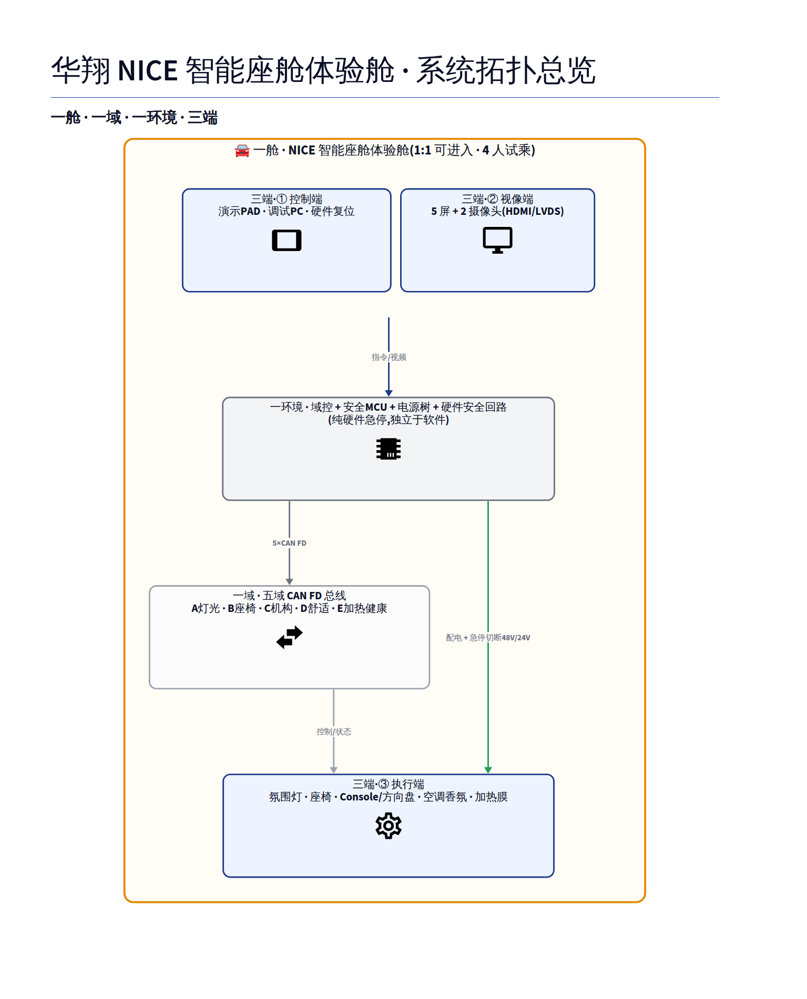

# 华翔 NICE 智能座舱体验舱
## 系统拓扑图

依据《NICE 智能座舱体验舱 方案沟通 V2.0》(Tech Spec V1.3)

**一舱 · 一域(五域 CAN FD) · 一环境 · 三端**

---

## 架构口诀:一句话讲清整个系统

| 口诀 | 对应内容 |
|---|---|
| **一舱** | NICE 智能座舱体验舱(1:1 可进入 · 4 人试乘) |
| **一域** | 五域 CAN FD 总线(灯光/座椅/机构/舒适/加热健康) |
| **一环境** | 域控制器 + 安全MCU + 电源树 + 硬件安全回路 |
| **三端** | 控制端(下指令)· 视像端(呈现/采集)· 执行端(驱动机构) |

> 三端对应文档六层架构表里的三个"末梢层";甲供/乙供是节点级标签,不单独立"端"。

<!-- _class: lead -->

---

<!-- _class: topo -->

---

## 关键设计要点

- **硬件安全回路独立于软件**:软件死机/总线掉线不影响急停有效性
- **急停边界精确**:仅切断 48V/24V 动力(座椅/机构),13V 加热 NTC 自断,12V/5V 保监控不断
- **CAN 只传信令、不传电**:电源树直供执行端物理节点,与总线分离
- **甲供接口预留占位**:IMSE 膜 / 星空天幕光纤 / 健康监测控制器,CAN FD/以太网协议待定

> 本页为答辩总览图;逐节点参数(CAN ID / 电压 / 端接)见技术附件
> `curriculum/案例标杆/华翔NICE座舱-系统拓扑图.svg`,供技术评委现场调阅。

---

# Q&A

**NICE-PROPOSAL-V2.0** · 内容依据《NICE 智能座舱项目技术要求》V1.3
